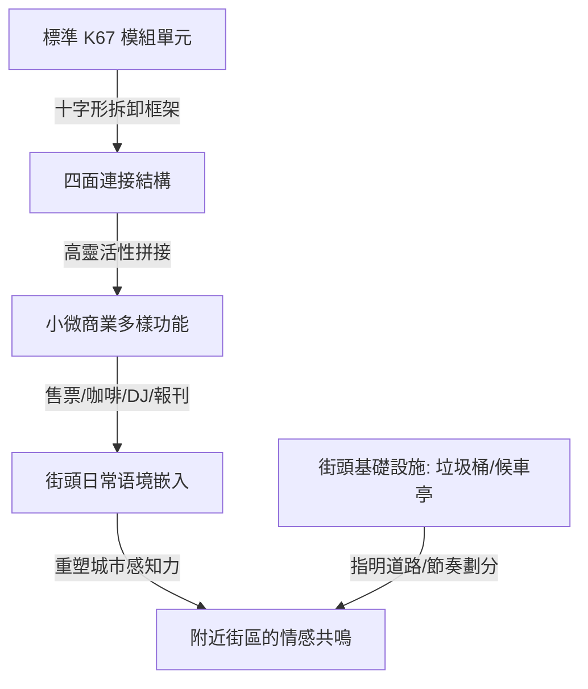

# K67 Kiosk：這個紅色小亭子，藏著一個時代的模組化想像

## 核心解讀
K67 報刊亭（設計於 1966 年）是由斯洛文尼亞設計師 Saša J. Mächtig 操刀的模組化街頭介質系統。它並非一個死板的實體建築，而是一個利用塑料與玻璃纖維打造、可獨立運輸且透過十字形框架四面自由拼接與代謝的「生長系統」。它在南斯拉夫的街頭巷尾演變成了售票處、咖啡角、小食攤、甚至 DJ 台。它最深遠的啟示在於**「介於建築與產品之間的新尺度」**——城市微型基礎設施（如報刊亭、垃圾桶、公共電話亭）不只是功能容器，更是影響和塑造人類對環境理解、引導街道人流、用節奏劃分公共區域的「空間情緒觸點」。

## 創新堆疊與情緒價值
*   **介於建築與產品的「微尺度」**：在 [[商業模式]] 中，傳統大地產模式是宏大且固化的（如租金依賴的格子間）；而 K67 提供了一種「低成本、高靈活性、隨插隨用」的微商業載體，讓個體與主理人能夠像拼 USM 櫃子一樣，隨意拼裝出他們的情感表達場景，是[[設計]] 與 [[產品]] 交匯處的先鋒探索。
*   **基礎設施作為「空間情緒導航」**：Mächtig 提出，垃圾桶不只是清潔工具，它還在特定位置提示转向、指明道路，甚至以其視覺節奏劃分區域。這是一種潛移默化的「環境秩序感與被照顧感」，為使用者提供了極高的[[社會結構]] 情緒安慰。

## 實踐路徑
1.  **實體場景的「微單元策展」**：在進行街區更新或非標商業策展時，放棄「大興土木」的傳統路徑。引入如 K67 式的模組化微型裝置，以最低的物理改造成本，快速在街角堆疊出具備強烈視覺張力（如紅黑撞色）與功能多樣性的「街區情感休息站」。
2.  **以節奏感設計「附近」**：將垃圾桶、指示牌、長椅等微小街頭設施作為「記憶釘」與「視覺節奏點」進行一體化設計，以人性化的細節消解現代人穿行城市時的焦慮感，創造讓步行者想停留、想探索的微型[[設計]] 系統。

---
**關聯筆記**：
*   [[設計]]
*   [[產品]]
*   [[商業模式]]
*   [[社會結構]]
*   [[2026-05-18-從首店開業到文旅目的地的模式躍遷，從傳統商業的「租金依賴」向「品牌孵化+價值投資」模式轉型|從首店開業到文旅目的地的模式躍遷]]
