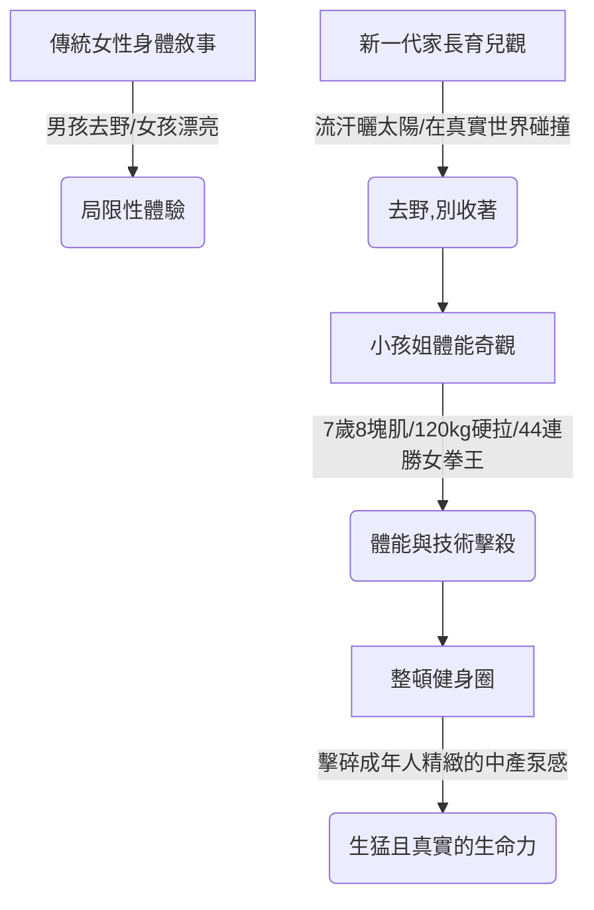

## 核心洞察
擺脫傳統「安靜漂亮」劇本的「小孩姐」，用生猛的身體主導權與野性生命力，無情擊碎了成年人虛假的精緻中產健身幻覺。

## 重點摘要

- **「小孩姐」的體能奇觀**：7歲做20個標準引體向上、7歲練出8塊腹肌、120kg硬拉（體重不滿70斤）、6歲拳擊戰神44場連勝。她們不僅僅是力量，更是極致體能與精湛技術的融合。
- **女孩身體敘事的轉變**：打破「男孩爬樹翻牆、女孩漂亮拉伸」的舊劇本，新一代父母主動將女兒送進攀岩館、滑板場與拳擊台。「去野，別收著」成為新的文化密碼。
- **真實生命力對精緻虛榮的反叛**：成年人在健身房鏡子裡追求昂貴的「泵感」與「打卡裝備」，卻在毫不費力的「天賦怪」小孩姐面前集體精緻破防。

## 值得深思的問題
1. **身體敘事與空間設計**：在城市與空間設計（如台中舊城區的公共空間）中，我們的公園設施和單杠區是否能支撐這種新一代「野性野蠻生長」的需求？還是依然充滿了為「安全第一、防範受傷」而閹割了挑戰性的平庸設施？
2. **消費升級的偽命題**：成年人的健身充滿了昂貴的裝備、補劑與社群打卡，但小孩姐的生猛生命力只需要一根鐵桿和真實的泥土。這對「體驗經濟」有何啟發？我們是否在用過度設計的「技術基礎設施」掩蓋「核心體驗」的匱乏？
3. **人才培育的顧問啟發**：教練指出小孩姐「是喜歡，不是堅持與努力」。在企業顧問與團隊系統設計中，我們如何區分「系統強加的堅持」與「本能釋放的熱愛」？如何建立一個允許員工「野蠻生長、去野別收」的文化基礎設施？

## 關聯筆記
- [[2026-05-14-遊戲裡爆改老破小，是疲憊成年人的新型安慰劑|遊戲裡爆改老破小，是疲憊成年人的新型安慰劑]]：代表疲憊成年人藉由虛擬遊戲尋求「掌控感」與安慰，反襯出「小孩姐」在真實世界中藉由對身體掌控展現的生猛生命力。
- [[2026-05-14-確實，生理性喜歡是不會騙人的|確實，生理性喜歡是不會騙人的]]：同樣強調「生理本能」與真實體驗的重要性，說明對身體掌控的快樂與生命力是無法被「偽裝」或「努力」替代的，而是生理本能的釋放。
- [[2026-05-14-省油省錢的小電驢，正在掏空中女錢包|省油省錢的小電驢，正在掏空中女錢包]]：探討現代人在「實用」與「生活方式自由」之間做出的抉擇，女孩身體敘事的轉變與對小電驢的喜愛都體現了對自主掌控權的追尋。

---
> [!TIP]
> 文化的生命力，來自不被定義的混亂。
