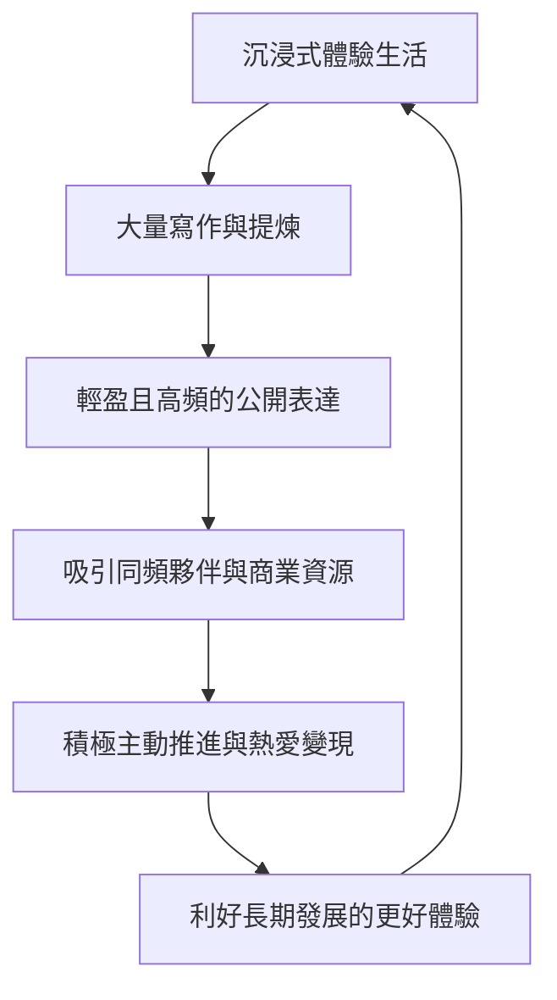

# 下一輪個人IP的紅利，就是把你的體驗變成錢

> [!TIP] 偷偷的溫暖釀造
> 當世界被 AI 的效率與演算法完全填滿時，完美和標準化便不再具有高溢價。我們身上那些看似「漏洞百出」的真實掙扎、高敏感、甚至拖延症，才是 AI 永遠無法代償的「默會體溫」。順著天性去生活、下場去實修、用最輕盈的公開表達把你的生命水溫交付出去，世界自然會為你的「真活人感」買單。

---

## 核心觀點

### 1. 體驗即是實修：知與行之間的「感知力水溫」
做個人 IP 的核心阻礙不是缺乏技巧或規劃，而是因為完美主義導致的「謀而後動」與「思考代替行動」。在科技狂飆的去中介化時代，唯有真正「下場肉身試水溫」所沉澱的生命經驗，才是無可替代的資產。

### 2. 未來個人 IP 的兩條生路
*   **跟 AI 並肩，衝到最前沿**：學習工具、用演算法與數位員工放大效率（對應「數位員工/會思考的智慧體」）。
*   **做個人，做 AI 做不到的事**：AI 無法代替人類的情感與獨特生命體驗。當專業與效率被大模型平民化，私人、真實且具備真誠共情能力的「人味體驗」反而會迎來高溢價。

### 3. 「真活人感」與「素人非虛構寫作」的時代紅利
消費者對「表演努力的精緻包裝」已產生系統性免疫，轉而渴望看見敢於坦露脆弱、認真體驗生活、不裝不演的真實活人。《我在北京送快遞》等作品的火爆，證明了素人寫作的時代已經來臨——你的體驗就是你最好的內容。

### 4. 體驗派 IP 變現的閉環路徑

---

## 精華金句

1.  **活人感不是熱鬧，不是真人出鏡，而是你切切實實的感受著真實的生活，從「人的視角」出發，去思考，去書寫，去鏈接。**
2.  **有些人是總結、表達世界，而體驗派的創作是「更新」世界。失敗或成功都只是一個事件，你存在的價值從來不在那些事件裡，你在你自己這裡。**
3.  **AI都這樣了，你的三觀就是你的生命體驗。只要你體驗過，就是比別人更牛。**
4.  **活着，活好，是你人生的主線任務。做IP，只是順帶的事。**

---

## 延伸閱讀與知識關聯
*   [[2026-05-18-想轉行AI產品經理，90%的人第一步就走錯了！|想轉行AI產品經理，90%的人第一步就走錯了！]]：AI 產品經理的內核依然是解決業務痛點的產品思維，而非盲目卷底層算法。普通人若要在 AI 時代進行產品創新，應將技術作為提效拼圖，重點依然是基於自身「獨特體驗與感知力」去社會的神經末梢撿錢。
*   [[2026-05-18-低谷期突圍最快的方式：換！換！換！|低谷期突圍最快的方式：換！換！換！]]：人在低谷時，將自己實修試水溫的失敗或痛點進行「蒸餾與寫作」，以破局者視角對外提供避坑價值，是體驗變現、觸底反彈的極佳路徑。
*   [[2026-05-18-AI創業時代，一人公司的七種打開方式|AI創業時代，一人公司的七種打開方式]]：一人公司利用 AI 智慧體代償人力，但其靈魂依然取決於創始人的「生命體驗」與人文底色。
*   [[2026-05-18-AI到底會不會讓大學變成一堆沒用的磚頭？|AI到底會不會讓大學變成一堆沒用的磚頭？]]：當標準化知識免費，只有老匠人的「默會知識（體驗實修）」能通過在場交互傳遞。
*   [[2026-05-16-Agent 生態五大黃金創業賽道|Agent 生態五大黃金創業賽道]]：OPC+FDE 模式中，個人創業者最強的核心競爭力就是其獨特的垂直行業「體驗感知力」與關係聯結力。
