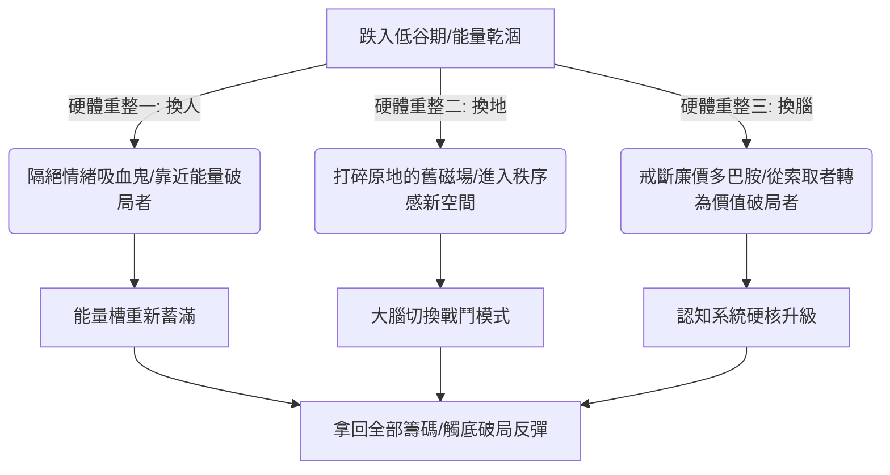

## 核心洞察
當生活將你打倒時，並非逼你躺平，而是強制你進行一次「關機重啟」。人在低谷期，最致命的錯誤是「一腔孤勇地在爛泥地裡死熬」。導致低谷的往往是舊有的認知模型與環境磁場，真正的觸底反彈，依賴於決斷的重塑——透過「換人、換地、換腦」這三項硬核的內外部硬體升級，重整能量場，從索取者升級為破局者。

## 重點摘要

- **換人：隔絕情緒吸血鬼**：
  - 「情緒吸血鬼」透過大吐苦水、輸出焦慮、冷嘲熱諷榨乾他人微薄的能量。低谷期能量本就捉襟見肘，必須毫不留情地隔絕無效社交，斬斷「有毒關係」，主動靠近即便失敗也在復盤找方向的破局者，「借別人的火，點自己的燈」。
- **換地：打破舊環境磁場的禁錮**：
  - 大腦的意志力常被高估，而環境的潛移默化卻被低估。當長時間在一個空間（如雜亂的臥室）經歷失敗，每件舊物都會變成觸發負面情緒的開關。
  - 挪個窩，換個氣，帶上電腦去圖書館或咖啡館，用秩序感的新空間重構大腦的「戰鬥模式」。
- **換腦：粉碎過期認知與索取者思維**：
  - 格式化 C 盤：戒斷廉價多巴胺（短視頻、爽文），強迫進行高質量的硬核商業與技能輸入。
  - 轉換視角：打破「誰能救我」的弱者索取思維，轉換為「我的失敗與經驗能為他人提供什麼價值、幫別人避什麼坑」的價值提供者視角。

## 值得深思的問題
1. **「換地」在非標工作流與生活設計中的應用**：本文指出失業者穿戴整齊去圖書館工作，能重置大腦戰鬥模式。在我們面對高度緊繃的「Always-on」數位游牧工作時，我們如何為自己設計一套「微型環境卸載儀式」？如何透過桌面的微觀秩序整理、或空間功能的絕對隔離，來守護能量 Pacing？
2. **「情緒吸血鬼」的商業與諮詢防禦**：在商業諮詢或客戶對接中，我們也常遇到大量消耗我們心力的「情緒吸血鬼客戶」。作為超級個體，我們如何建立一套堅固的「關係篩選機制」，在商業層面實施毫不留情的「朋友圈清理」，以確保我們的創意精力只流向能產生複利的高質量合作者？
3. **「失敗經驗的價值提供者化」**：很多人在創業失敗或項目爆雷後陷入極度自我否定。我們如何引導受挫的個體，利用「寫作與蒸餾」將個人的失敗轉化為他人避坑的「知識資產」？如何用這種價值輸出，作為最快的「自救與轉運」藥方？

## 關聯筆記
- [[2026-05-18-當身心與生活都在超載，我們該如何找回失落的輕盈|當身心與生活都在超載，我們該如何找回失落的輕盈]]：低谷期的「換人換地」本質上就是一種主動的「身心重擔系統性卸載」，為乾涸的能量進行物理性防禦。
- [[2026-05-18-慢性疲勞纏上年輕一代，查不出任何病，但我的身體真的「壞了」|慢性疲勞纏上年輕一代：查不出任何病，但我的身體真的「壞了」]]：慢性疲勞的根源往往是能量透支，本篇提供的「隔絕情緒吸血鬼、戒斷廉價多巴胺」是重整神經系統、實施能量 Pacing 自救的具體生活方式指南。
- [[2026-05-18-下一輪個人IP的紅利，就是把你的體驗變成錢|下一輪個人IP的紅利，就是把你的體驗變成錢]]：本篇指出的「將失敗經驗轉化為避坑價值輸出」，正是將個人親身痛苦與體驗「知識資產化」、轉化為個人 IP 獨特說服力與商業變現的底層邏輯。

---
> [!TIP]
> 跌入谷底是生活強制發給你的「舊系統淘汰通知」。不要拿著破舊的船票去登明天的客船。當你狠下心清理爛人、逃離死地、格式化舊腦，你便不再是命運的囚徒，而是手握新遊戲規則的破局者。
