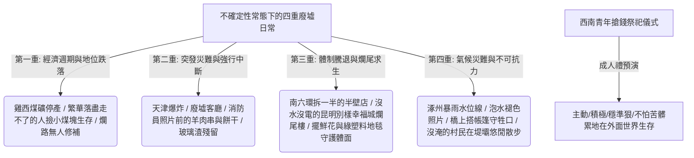

## 核心洞察
「經濟運行有自己的週期，但對於那些身處其中的普通人來說，生活始終充滿了不確定性。」攝影師鄒璧宇歷時十年進入一百多戶人家，用鏡頭戳破了被商品房廣告與精緻中產生活所「虛構出來的安全感」。不論是繁榮過去後雞西煤礦走不了的生存泥濘、天津爆炸後廢墟客廳與舊樓殘留玻璃渣、南六環騰退被拆一半的半壁店，還是沒水沒電卻擺著鮮花綠塑料布地毯的昆明「別樣幸福城」爛尾樓，均呈顯了：**「在不確定性常態化的廢墟微觀日常中，人類守護體面、生機與樂觀的肉身秩序，才是最偉大的真實。」** 西南苗族年輕人假扮鬼怪搶錢的儀式，更是他們被迫去外面世界謀生「成人禮」的血肉預演——要想在不確定的洪流中生存，就得更主動、更穩準狠，比別人能忍受更多極端條件。

## 重點摘要

- **被虛構的安全感與戛然而止的生活**：
  - 開發商在宣傳冊、街邊廣告牌上幫大眾構想好「無瑕的美好生活」，但一場意外、一場騰退或一次爛尾，瞬間會讓生活強行中斷。
  - **災難抹平後的微觀刺點**：天津爆炸現場一年後被改建成公園和學區房，房價回升，看似「什麼都沒發生過」，但在海港城不遠的舊樓裡，依然能看見十年前爆炸震碎的玻璃渣。這是任何繁榮敘事都無法抹去的真實傷疤。
- **廢墟日常下的生理與精神雙重在場**：
  - **爛尾樓裡的極致體面**：在昆明沒水沒電的「別樣幸福城」裡生活，業主們依然活得有滋有味：插著朋友送的花、鋪著綠色塑料布地毯、牆上貼著小朋友畫的爸爸媽媽與完好的家。
  - **同一張桌子上的期盼**：在甘肅山洪泥石流後的農戶雜物間裡，桌上同時放著化肥、農藥、財神、觀音。農民把物理層面（農藥化肥）與精神層面（神明觀音）對風調雨順的期盼，毫無違和地擺在一起。
- **西南年轻人的「搶錢成人禮」**：
  - 廣西苗族祭祀儀式上，年輕人穿松柏枝戴木面具扮演鬼怪。儀式後半段村民撒錢，大家瘋狂投入搶奪。這項儀式如同他們去大城市打工的「預演」——要想生存，就得更積極主動、穩準狠、不怕苦髒累、比別人能忍受更多極端的條件。

## 值得深思的問題
1. **「玻璃渣」作為內容創作與顧問諮詢中的「真實刺點」**：在商業世界與品牌公關中，大眾習慣用「學區房漲價、改建公園、一切都好」的宏大敘事去掩蓋傷痕。但攝影師卻能在舊樓角落找到「十年前的玻璃渣」。這對我們的內容蒸餾與個人 IP 有何啟示？在千篇一律的精緻自媒體中，如何尋找我們自己產業中的「碎玻璃渣」，用這些刺痛感重建與用戶最深刻的真實信任？
2. **「財神與農藥共處一案」的中國末梢底層邏輯**：農民將化肥農藥與財神觀音擺在同一張桌子上，反映了一種極具中國底層智慧的「實用主義信仰與雙重避險機制」。在面對商業不確定性時，我們該如何協助客戶既建立「物理防線（工具、SOP、風控）」，又安頓「心理防線（文化、願景、信念）」？
3. **「爛尾樓裡的綠地毯」對中產階級精緻焦慮的降維打擊**：現在中產階級為了學區房、消費品牌降級而集體焦慮內耗。而爛尾樓業主在極限生存下，用一塊綠色塑料布當地毯來取悅自己、保持體面。這種「極限環境下的自主掌控力」，如何啟發我們在面對客戶的身心超載焦慮時，引導他們重構「體面與幸福的最小可行性邊界（MVP）」？

## 關聯筆記
- [[2026-05-18-當身心與生活都在超載，我們該如何找回失落的輕盈|當身心與生活都在“超載”，我們該如何找回失落的輕盈]]：兩者均涉及了「極限重壓下的身心自救與秩序重建」——超載社會下的年輕人需要用藥物與能量 Pacing 卸下身心重擔，而爛尾樓與災後農民則用綠地毯、擺花與悠閒散步，在物理廢墟上奪回心理的輕盈掌控權。
- [[2026-05-18-工作毀掉了我美好的人性|工作毀掉了我美好的人性]]：胡安焉在湍急異化的系統中透過老實洋蔥式內觀和文學寫作保留感受力，這與鄒璧宇在不確定的廢墟中，被那些用雙手重建生活、保持樂觀與體面的普通人（老實人）所治癒，在本質上完全相通——都是肉身直面生活的廢墟，用最真實的在場抵抗異化與遺忘。
- [[2026-05-18-熬過1480天的大廠人，不再渴望上岸|熬過1480天的大廠人，不再渴望上岸]]：張小滿打破「大廠水晶宮殿」虛構的安全感，認清「人生沒有岸」；這與鄒璧宇用十年鏡頭記錄一百多戶人家被中產繁榮虛構的安全感、被爛尾/爆炸/騰退中斷生活的「人生無岸」微觀史交相輝映。

---
> [!TIP]
> 所有的安全感，只要是依賴系統與宏大敘事給予的，都是脆弱被虛構的幻象。真正的安全感不是那張房產證，而是當生活被不可抗力砸成廢墟時，你依然能在一無所有的爛尾樓裡，鋪上一塊綠色塑料布地毯，插上一束朋友送的花。在不確定性中老實、體面且熱愛地活著，就是對系統性焦慮最優雅的反叛。
