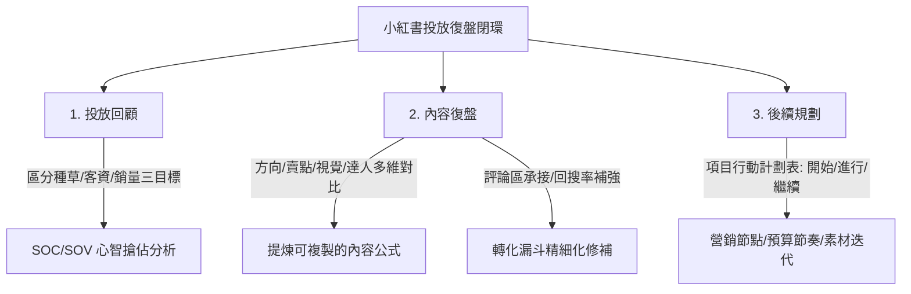

# 實際上，小紅書內容運營的正確框架是這樣的

## 核心解讀
中童觀察從小紅書官方能力認證體系內部的《效果運營投放複盤基礎框架》出發，揭示了強決策、強信任品類（如母嬰）在小紅書進行精準投放與內容運營的硬核閉環。文章指出，傳統僅羅列「點讚、曝光、評論」的無效複盤無法指導實操，真正的內容運營必須將**「內容表現」與「用戶決策路徑」深度綁定**，拆解為三大模塊：一是**投放回顧**，嚴格區分產品種草、客資收集與商品銷量三類目標，並以 SOC/SOV（份額分析）作為品類心智搶佔的北極星指標；二是**內容複盤**，摒棄「單篇爆文崇拜」，從內容方向、賣點類型、視覺色系及達人矩陣等維度進行跨筆記的相對相對表現歸因，提煉可複製的「內容公式」，並透過評論區轉化詞承接與回搜率（回訪搜尋）分析進行即時優化；三是**後續規劃**，以極致硬核的「項目行動計劃表」強制將複盤轉化為清晰的預算節奏與素材迭代路徑。

## 創新堆疊與情緒價值
*   **「生活狀態」的精準內容轉譯**：這極佳地呼應了 [[產品]] 中提及的「將有用轉化為跟我有什麼關係」。新一代用戶（如寶媽）的決策鏈路極長，她們會被测评建立信任、被场景激发需求。小紅書內容運營的本質，是在一個極度具體的生活狀態（如「新手媽媽夜間哺乳的焦慮十分鐘」）中，提供零解釋成本的體驗交付。
*   **回搜率作為「心智確認」指標**：互動率高但回搜率低，說明用戶只是一次性打卡，並未對品牌產生主動偏好。這與 [[行銷]] 中「降低解釋成本、打入記憶釘」的邏輯高度一致。主動搜尋（回搜）代表消費者在大腦中扎下了品牌的記憶釘。

## 實踐路徑
1.  **建立「多維歸因內容公式表」**：拒絕在複盤會上憑感覺讚美爆文。團隊必須建立一張結構化表格，將所有筆記按照「內容方向（測評/合集/Vlog）」、「賣點類型（場景/功能/興趣）」、「視覺主色系（溫暖奶油/專業冷灰）」以及「達人層級」進行打標。透過 CTR 與回搜率的相對對比，找出目前最能刺穿目標群體心智的「黃金內容公式」（如：專業冷灰+功能測評+KOL）。
2.  **啟動「評論區與回搜率」聯動修補機制**：
    *   *評論區轉化*：每日監控評論區，一旦出現「哪裡買」、「求鏈接」等轉化傾向詞，必須立刻用小紅書直客工具或私域進行精準詞彙承接。
    *   *回搜率低補強*：若某篇筆記互動率極佳，但後台回搜率（用戶看完筆記後在小紅書主動搜尋品牌詞的比例）極低，必須在下一輪素材迭代中，將品牌詞/產品名稱的提及次數與視覺比重前置，確保流量真正沉澱為品牌資產。

---
**關聯筆記**：
*   [[行銷]]
*   [[產品]]
*   [[商業模式]]
*   [[2026-05-14-當海外品牌生意進入精耕時代，618該怎麼找增長的確定性|當海外品牌生意進入「精耕時代」，618該怎麼找增長的確定性？]]
*   [[2026-05-15-一句話百元預算百萬級廣告片這個等式我們親測成立了|一句话+百万级广告片，这个等式我们亲测成立了]]
