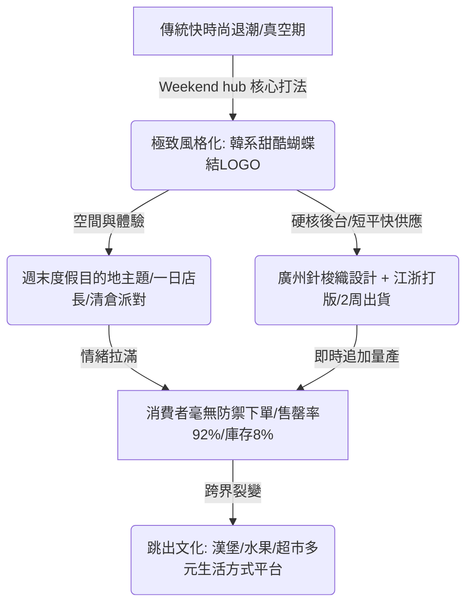

## 核心洞察
在傳統快時尚（ZARA、H&M）退潮的真空期，本土新銳女裝透過「極致風格化」降維打擊了「大牌平替」的舊快時尚模式。Weekend hub 的成功證明：現代女裝賣的不是尺碼，而是一種「我想成為的樣子（情緒價值與社群認同）」。透過「主題空間策展+一日店長活動」將清倉做成派對，並以「多地協作」的短平快供應鏈將庫存壓至極致，品牌正在演變為圍繞年輕人生活方式裂變的內容平台。

## 重點摘要

- **快時尚賣平替，風格品牌賣標籤**：
  - ZARA 等賣的是大牌款式的廉價複製，而 Weekend hub 賣的是「足夠多的選擇+清晰的風格標籤（韓系甜酷蝴蝶結）」。衣服穿出去，不用看標籤，別人也能一眼認出。它販賣的是女孩心目中「理想自我的投射」。
- **主題空間體驗與情緒卸載**：
  - 門店不只是承載貨架，而是圍繞「週末度假目的地」進行空間策展：廣州東山口店（酒店Staycation風）、武漢店（定制旋轉木馬派對風）、成都店（極簡工業不鏽鋼蝴蝶結風）。
  - 將爆火的「一日店長」與「博主明星化」融入線下，把促銷清倉做成「週末打包盲盒派對」，讓消費者在獲得高情緒價值的同時完成毫無品牌降級心理暗示的爽快消費。
- **後台硬核：多地協作與極速售罄率**：
  - **地理優勢與需求拆分**：設計部與簡單版型扎根全球服裝心臟廣州中大，快速選料打版；高品質工藝則外溢至江西和杭州。最快 2 週出貨。
  - **前端審度與買手評級**：每月新款做 S/A/B 評級，嚴格控制首單下單量，靠極速追單降低庫存。達成 2025 年售罄率 92%，庫存僅 8% 的同行神話。
  - **跳出文化平台化**：創辦人 Alan 將這套「確定主題 -> 空間策展 -> 活動流量轉化」的非標打法複製到漢堡店、水果店與新型超市，將服裝品牌升級為生活方式平台。

## 值得深思的問題
1. **「非標創意擴張」的連鎖困局**：Alan 提到跨城複製最難的不是供應鏈，而是「廣州店的床、武漢店的旋轉木馬等非標定制創意無法標準化複製」。在我們協助台灣非標商業或旅宿品牌進行連鎖擴張時，我們如何設計一套「核心概念標準化 + 在地創意客製化」的動態框架？如何平衡創意的獨特性與規模化運行的 SOP？
2. **台灣文創零售的「風格標籤化」啟示**：台灣擁有大量優秀的獨立文創與服飾品牌，但大多流於「溫和、小眾、無辨識度」，難以在大眾市場建立 Weekend hub 那種「穿出去一眼被認出」的強烈風格標籤。我們該如何引導台灣主理人，將小眾情懷提煉為具備高張力、可複製的「視覺符號心智（如蝴蝶結）」？
3. **「一日店長與打包盲盒」在去庫存時的品牌防護**：很多高端或設計師品牌最怕打折折損身段。Weekend hub 將打折包裝成博主聚會與五十元盲盒派對，不僅去掉了庫存，還拉高了用戶黏性。這種「把尷尬的促銷做成情緒狂歡」的行銷心智，如何平移應用到其他高溢價的體驗業態中？

## 關聯筆記
- [[2026-05-18-韓國時尚卷王殺入中國，3家店開局就火，放話要再開100家|韓國時尚卷王殺入中國，3家店開局就火，放話要再開100家]]：Weekend hub 與 Musinsa 的爆火路徑互為印證——兩者都是抓住了「韓系穿搭與甜酷少女心智」在中國本土的巨大真空，並透過高頻的線下場景營造，降維打擊了面目模糊的傳統快時尚。
- [[2026-05-18-為什麼追年輕人的商業，容易火但不容易持久？|為什麼追年輕人的商業，容易火但不容易持久？]]：本篇是追年輕人商業「持久贏」的極佳案例！Weekend hub 沒有掉入「旺丁不旺財」的陷阱，正是因為它用短平快供應鏈與 8% 的極低庫存，扛住了年輕人新鮮感半衰期短的脆弱性，並透過「跳出文化」平台化鎖定了關係資產。
- [[2026-05-13-EB Denim 旗艦店：零售、創意工作室與倉儲三合一|EB Denim 旗艦店：零售、創意工作室與倉儲三合一]]：兩者均打破了「零售店只是貨架」的傳統思維，EB Denim 透過展示幕後倉儲與設計工作室，Weekend hub 透過度假主題與派對場景，共同將空間轉化為傳遞價值認同的主題策展平台。

---
> [!TIP]
> 情緒不是行銷的糖衣，而是產品前端要設計的基因。
