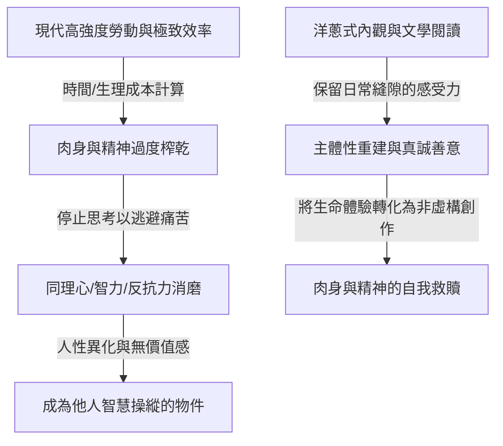

# 工作毀掉了我美好的人性

## 核心解讀
非虛構作家楊素秋基於胡安焉的《我在北京送快遞》與法國哲學家西蒙娜·薇依的《工廠日記》，深度剖析了現代勞動如何系統性地異化人的肉身與精神。在「效率恐怖主義」的計算法下，勞動者被迫用成本的眼光看待時間（如「小便的成本是 1 元，午飯的時間成本是 10 元」）。當日常的縫隙被極致的疲憊完全填滿時，人們會產生**「主動停止思考的誘惑」**以逃避無價值感與痛苦，進而導致智力退化、同理心與道德感的嚴重透支（如無法援助身邊的孕婦同事）。然而，胡安焉透過老實的「洋蔥式」自我觀照與持久的文學閱讀，在水流湍急的日常中頑強地拼湊並站穩自己的主體性，為現代打工人提供了一條「用生命體驗與真誠書寫」對抗異化的自我救贖之路。

## 創新堆疊與情緒價值
*   **「效率恐怖主義」下的主體性荒漠**：本篇極佳地呼應了 [[社會結構]] 中關於現代白領與體力勞動者在過載系統中的精神荒漠化。當個人的同理心與感受力被榨乾，人類的「溫水感知力」便降到冰點。
*   **「洋蔥洋心」的真實活人感**：胡安焉不管被工作剝離多少層，內部依賴是內外如一的洋蔥。這種與世界格格不入的「純真」和「老實」，恰恰是 [[學習與思考]] 中所提及「AI 時代大模型唯一無法蒸餾與代償的生命溫水」。

## 實踐路徑
1.  **刻意設計「停止效率」的日常縫隙**：拒絕讓自我時間完全被「成本/效益」度量衡所綁架。每天刻意保留 30 分鐘，不求效率、不求產出，僅進行純粹的生命在場（如散步、隨筆寫作或無目的閱讀），重新喚醒對「附近」的微觀感受力。
2.  **將「趔趄與真實掙扎」轉化為個人 IP 的真誠表達**：在 [[學習與思考]] 與個人品牌建構中，放棄營造完美的專業精英人設。大方且誠懇地呈現自己在工作與生活中的不完美、恥感與現實的拉扯。這種「不假裝、不表演」的洋蔥本色，反而能在泛濫的 AI 內容中快速刺穿消費者的心理防禦，建立最深層的真實信任。

---
**關聯筆記**：
*   [[學習與思考]]
*   [[社會結構]]
*   [[科技影響]]
*   [[2026-05-18-熬過1480天的大廠人，不再渴望上岸|熬過1480天的大廠人，不再渴望上岸]]：張小滿在大廠的水晶宮殿裡歷經兩次被裁與高壓異化，這與胡安焉在快遞系統中的體力勞動異化在精神壓迫上高度一致——皆是效率恐怖主義將人標準件化的代價，而素人非虛構寫作是他們重獲主體性自救的共同法門。
*   [[2026-05-18-下一輪個人IP的紅利，就是把你的體驗變成錢|下一輪個人IP的紅利]]
*   [[2026-05-18-十年裡我進入一百多戶人家，拍攝生活的不確定性和被虛構出來的安全感|十年裡我進入一百多戶人家，拍攝生活的不確定性和被虛構出來的安全感]]：攝影師鄒璧宇用鏡頭對廢墟生活與不確定性的「老實記錄」，與胡安焉在快遞異化系統中以「老實洋蔥內觀」來保留日常微觀感受力的主體性救贖本質完全相通——皆是摒棄宏大虛無敘事，用最真實的肉身在場，在不確定的廢墟中頑強捍衛主體性尊嚴。
*   [[2026-05-18-絕望的直女：如何厭男又愛男？|絕望的直女：如何厭男又愛男？]]：觀念指標對主體性與肉身生機的異化——流行的性別觀念（主義指標）與社群政治正確，在直女約會中施加了極致的「思慮過剩與道德審查」，導致了愛與性的主體性蕭條；這與「效率恐怖主義（工作指標）在勞動系統中對打工人人性的過度榨乾與修剪」在精神本質上高度一致——皆是外界的「工具性指標指標」對活人生命熱情與本真生機的無情閹割。
