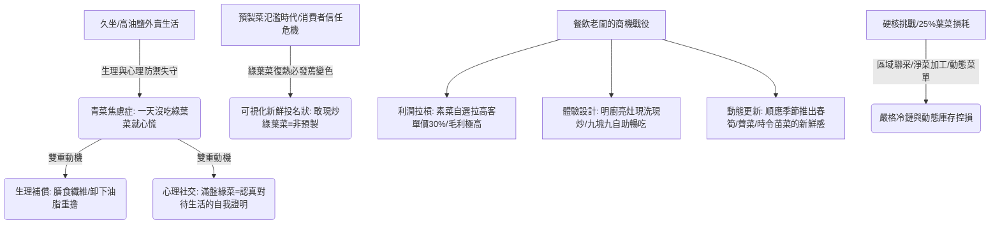

## 核心洞察
在 Always-on 與高壓久坐的辦公環境下，高油、高鹽、多肉的外賣結構催生了年輕人對綠葉菜的強烈「生理性補償與健康焦慮」。一天不吃綠葉菜就心慌的「青菜焦慮症」已成為 2026 年核心消費大勢。由於綠葉菜「復熱即變黃發蔫」的物理特性，它成為了餐飲經營者向消費者表明食材新鮮、非預製菜的「可視化新鮮投名狀」。誰能將一盤清脆新鮮的青菜端到離年輕人最近的地方，誰就握有了高黏性、高毛利的流量密碼。

## 重點摘要

- **青菜焦慮的底層邏輯：生理代償與社交人設**：
  - **生理代償**：久坐辦公與外賣重油重鹽，讓綠葉菜從「配菜」升格為強穩定性的「保底任務與自救補償」。
  - **認真對待生活的投名狀**：在小紅書等社媒發布一盤鮮綠的青菜，是年輕人對外展示「今天也好好照顧自己、自律且精緻」的低成本社交證明，話題量達 1.8 億次。
- **對抗預製菜的「視覺燈塔」**：
  - 消費者對預製工藝識別日益精準。綠葉菜復熱易黃、出水、發蔫，無法被完美預製。明廚現洗現炒的青菜，是用最直觀的視覺語言，打破消費者對「預製菜、科技與狠活」的防禦心防，成為整頓飯新鮮品質的信任背書。
- **高溢價利潤與供應鏈的雙刃劍**：
  - **以菜定價的利潤槓桿**：盒飯與快餐店上架素菜自選，多選一道素菜可將客單價拉高 30%，而青菜成本極低。火鍋店的九塊九綠菜暢吃或時令野菜（如香椿炒蛋、薺菜餃子）能持續製造稀缺新鮮感。
  - **25% 損耗的供應鏈懸刃**：葉菜損耗率高達 25%（常溫僅 1—3 天），冷鏈溫度超標 1 小時腐敗率升 20%。採購與庫存管理不善，损耗會吞噬全部利潤。需配合「動態菜单管理與淨菜代加工」進行精細控損。

## 值得深思的問題
1. **「青菜焦慮症」在台灣健康餐飲與超商防禦的平移**：台灣超商（如 7-11、全家）的健康沙拉與低卡便當發展極度 mature，但微波加熱的綠葉蔬菜往往帶有「發黃發酸、軟爛無生氣」的工業化感官。我們是否能在台灣市場引進「明檔現炒綠色蔬菜盒餐」的非標快餐模式？如何用「可視化的清脆綠葉（視覺霸權）」打破消費者對超商微波食品的審美疲勞？
2. **綠葉菜作為「非預製信任背書」的空間化設計**：如果綠葉菜是最好的「非預製投名狀」，餐飲空間該如何進行 visual storytelling？我們是否能將「蔬菜種植牆」、「每日新鮮蔬菜筐」或「明檔洗菜切菜區」作為餐廳入口的景觀設計，用生機勃勃的「綠意」直接建立健康與信任的空間心智？
3. **季節稀缺性菜單（時令苗菜）對抗價格內卷**：台灣四季雨水與颱風極易造成葉菜價格暴漲，餐飲小店如何實施「動態蔬菜管理」？如何透過開發菌菇、時令芽苗菜（如豌豆苗、苜蓿芽等水培易控溫菜品）來建立一套「抗颱風、高溢價且可持續供應」的抗通膨綠色菜單？

## 關聯筆記
- [[2026-05-18-當身心與生活都在超載，我們該如何找回失落的輕盈|當身心與生活都在超載，我們該如何找回失落的輕盈]]：年輕人對綠葉菜的「青菜焦慮」與生理補償，本質上是他們在超載的 Always-on 狀態下，為避免身體物理性崩潰（PEM、慢性病）所實施的一種自我救贖的生活方式。
- [[2026-05-15-新鮮零食，擠進商場B1層|新鮮零食，擠進商場B1層]]：兩者皆是利用「可視化新鮮」來進行降維溝通——新鮮零食現切、青菜明檔現炒，都是用最直觀、不費腦的實體感官事實，降解消費者的決策成本與信任成本。
- [[2026-05-14-省油省錢的小電驢，正在掏空中女錢包|省油省錢的小電驢，正在掏空中女錢包]]：兩者都是現代都市人面對系統性壓力時的「微型防禦策略」——小電驢是為了在通勤中擁有一片自由呼吸的領地，吃青菜是為了在重油外賣中擁有一盤照顧好身體的健康主權。

---
> [!TIP]
> 餐飲品牌的壁壘，不在廚房在記憶。
