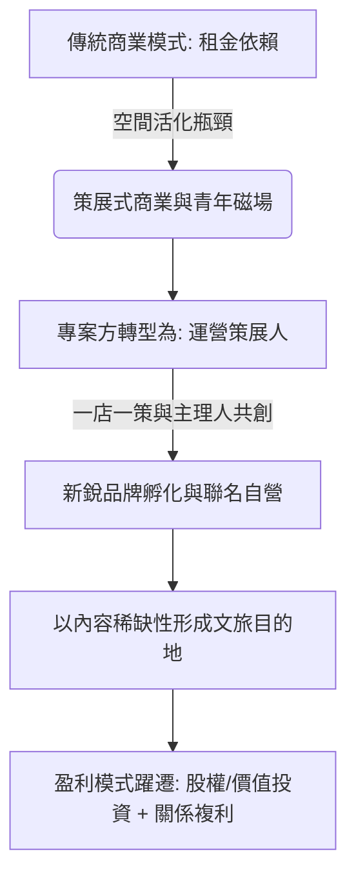

# 從首店開業到文旅目的地的模式躍遷，從傳統商業的「租金依賴」向「品牌孵化+價值投資」模式轉型

> [!TIP] 偷偷的溫暖釀造
> 傳統商場靠出租格子間收租，就像是沒有溫度的「租金依賴」；而在新文旅與青年力時代，我們自己必須扮演「街區策展人」的靈魂。正如成都 COSMO 和台中舊城活化，真正的繁榮不再於招了多少家連鎖大店，而是與在地的新銳主理人、青年品牌深度共創、孵化關係。這不是租賃博弈，而是「時間與情感的價值投資」。

---

## 核心觀點

### 1. 首發經濟的國家戰略與定義演進
「積極推進首發經濟」於 2026 年寫入國家「十五五」規劃，首發經濟正式上升為國家中長期戰略。定義已從單純招募首店的「首店經濟」，演進為涵蓋新品發布、新業態落地、研發中心設立等全生命週期的「首發鏈（首鏈）」。

### 2. Z 世代「情價值（情緒消費）」的需求側邏輯
2026 年中國情緒消費市場規模達 2.72 萬億元。消費者（尤其是 Z 世代）正從「外在消費」轉向「內在自我」投資，「情價比」與「與我相關」替代「性價比」。傳統商業賴以運轉的「效率優先」正讓位於「體驗優先」，這為「首發品牌 + 文旅目的地」的空間活化提供了強大的需求支撐。

### 3. 三大核心趨勢：文化主題、情緒價值與沉浸式空間
*   **文化主題（品牌敘事）**：擺脫全球標準化複製，走向「一城一策」的在地轉譯。將城市記憶與傳統工藝轉化為當代審美的敘事空間。
*   **情緒價值（設計參數）**：將「治癒、解壓、悅己」等情緒指標嵌入空間設計。建立「情緒觸點系統（引導、驚喜、離店儀式）」，以開闊動線消解心理壓力。
*   **沉浸式場景（內容運營）**：從「一次性裝修」向「可更新的策展互動內容」躍遷。預留數字媒介與模塊化展陳的硬體接口，以低成本、高頻次內容迭代代替重資產翻新。

### 4. 商業模式的躍遷：品牌孵化與價值投資

---

## 精華金句

1.  **首發品牌本身就是文旅目的地。投入資源的目的不應止於引流，更應將「首店」的稀缺性進行持續性內容運營，構建基於內容的用戶粘性。**
2.  **「策展式+主理人共創」模式正在替代傳統招商邏輯。真正有生命力的首發品牌，依賴於品牌與專案方的內容共創，而非知名度。**
3.  **首店不是一次性事件，而是一場持續的關係建設。將首店從「坪效載體」升級為「關係起點」，才能完成從流量入口向產業生態的範式躍遷。**
4.  **這世界沒有真相，只有視角。**（尼采，引自營造社信條）

---

## 延伸閱讀與知識關聯
*   [[2026-05-18-AI創業時代，一人公司的七種打開方式|AI創業時代，一人公司的七種打開方式]]：超級個體與品牌主理人是首發文旅中最活躍的微觀因子，OPC + FDE 的品牌孵化模式正重塑地方商業。
*   [[2026-05-18-Markdown 已死，HTML 登基：極客思維正在毀掉你的交付力|Markdown 已死，HTML 登基：極客思維正在毀掉你的交付力]]：成都 COSMO 「一店一策」的百店百面，就是用高質感的 HTML 視覺成品替代粗糙的 Markdown 格子間，給予青年人降維打擊的視覺衝擊。
*   [[2026-05-18-AI到底會不會讓大學變成一堆沒用的磚頭？|AI到底會不會讓大學變成一堆沒用的磚頭？]]：在實體空間中與非遺匠人、主理人交互的「默會知識」，是無法被數位化蒸餾的線下體驗護城河。
