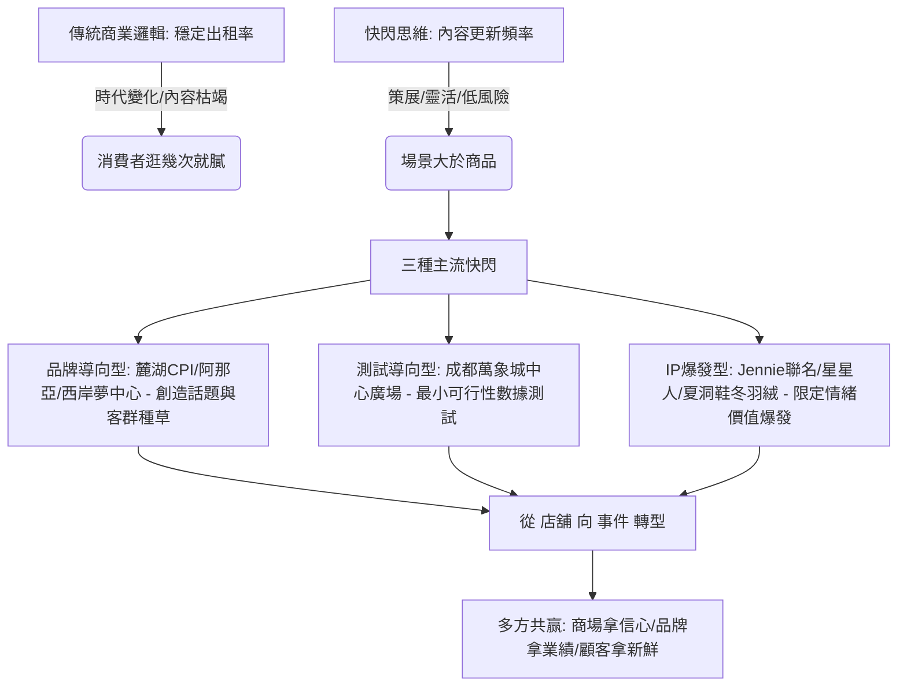

## 核心洞察
快閃店已從補充式的「游擊戰術」迭代為商場與品牌的「主流思維」：在穩定出租率讓位於內容更新頻率的時代，「場景大於商品」的靈活策展，正成為重整人流與激發新鮮感的情緒起搏器。

## 重點摘要

- **三種核心快閃模式的合圍**：
  1. **品牌導向型**：如麓湖 CPI 的 Vivienne Westwood 展，非單純零售，而是與遠郊商業在質感調性上的共鳴。
  2. **測試導向型**：如成都萬象城中心廣場，因空間性質限制，以高裝修造價進行限時測試，亮眼者搬入店舖，實現「最小成本試最大可能」。
  3. **IP 爆發型**：如名創優品 x Jennie 聯名、泡泡瑪特星星人系列，賣的是限量、限時、特殊身份的「限定情緒價值」。
- **主流思維的變遷**：南頭古城、安福路 HARMAY 話梅的街頭「立體櫥窗」化，說明實體商業價值觀正在重塑。消費者逛商場不再是購物，而是為了打發時間與尋求刺激，快閃成為最低成本的獲客放大器。

## 值得深思的問題
1. **「非標商業」的生命週期焦慮**：麓湖 CPI 或阿那亞等非標商業天生依賴「內容頻率」，但當快閃的頻率高到消費者產生「美學疲勞」時，下一個內容引擎是什麼？我們如何避免讓「快閃」本身變成另一種流水線式的平庸？
2. **空間更新的顧問啟發**：台中舊城區的閒置空間或歷史街區改造中，是否能引進「成都萬象城中心廣場」的邏輯？不追求長租，而是將公共廣場或街角打造成一個「永久性的快閃基礎設施」，以此降低在地青創與外部品牌入駐的試錯門檻？
3. **場景大於商品的情緒定價**：Gentle Monster / TAMBURINS 將銷售空間壓縮，將 80% 用於快閃裝置，為什麼這種反常規的「浪費」反而能帶來極高的坪效？我們如何將這種「情緒掌控能力」複製到地方伴手禮或文化品牌的體驗設計中？

## 關聯筆記
- [[2026-05-18-一場飛拉達的背後，猛獁象如何讓戶外走進大眾生活|一場飛拉達的背後，猛獁象如何讓戶外走進大眾生活？]]：探討品牌如何與線下頂級商業空間深度耦合，透過限時與常態並重的生活體驗空間，與社群建立情感連結。
- [[2026-05-17-肯德基也要被賣了？|肯德基也要被賣了？]]：大型連鎖餐飲品牌的龐大與沉重，反襯出當前消費市場中「輕量、靈活、高更新頻率」的非標快閃模式是如何能敏捷承接當下注意力資源。
- [[2026-05-15-從首店開業到文旅目的地的模式躍遷，從傳統商業的「租金依賴」向「品牌孵化+價值投資」模式轉型|從首店開業到文旅目的地的模式躍遷]]：討論實體商業如何從收租金轉向品牌孵化與價值投資，快閃店正是這一模式躍遷中最靈活的測試基礎設施與孵化利器。

---
> [!TIP]
> 過去的商場最在意「穩定出租率」，現在的商場更在意「內容更新頻率」。在新鮮感達致頂峰的時代，一個沒有快閃的空間，在年輕人眼裡就是沒有靈魂的無聊容器。
