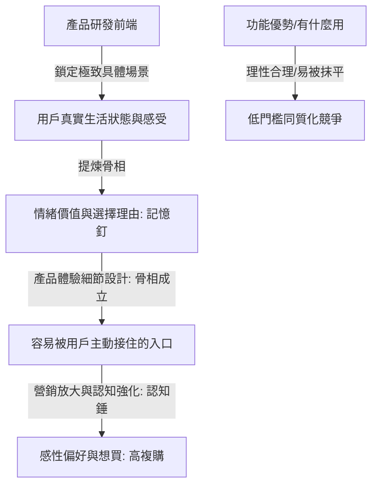

# 情緒消費不是賣情緒，而是讓產品從「有用」變成「想買」

## 核心洞察

## 關聯筆記
- (待補充相關筆記)

---
> [!TIP]
> 情緒不是行銷的糖衣，而是產品前端要設計的基因。

## 重點摘要

## 值得深思的問題
1. 當功能賣點成為行業標配後，品牌的下一個差異化護城河會是什麼？
2. 「拒絕比需求更有價值」——你還觀察到哪些拒絕背後的真實生活壓力？
3. 如果你的產品明天被禁止使用「情緒價值」四個字做行銷，你還能用什麼方式讓消費者想買？
(待補充重點摘要)
賀大億深度剖析了新消費產品增長的核心瓶頸：企業習慣於將產品研發與情緒行銷割裂，導致行銷部門後期只能在一個骨相不成立的產品上硬編文案「補妝」。他指出，**「情緒價值不是行銷後期貼上的糖衣，而是產品在開發前端就要設計進去的增長基因」**。在基礎功能極易被快速抹平的今天，用戶的決策邏輯已從理性的「有什麼用（解決使用）」徹底轉向感性的「跟我有什麼關係（解決偏好）」。真正的情緒價值是讓產品成為一個**「容易被用戶主動放進生活裡的介質」**。這要求產品在研發前端必須鎖定極致具體的場景（如「下午三點撐住情緒的小獎勵」而非模糊的「年輕人喜歡」），並透過微觀體驗觸點將其固化為清晰的「選擇理由」（記憶釘），最後在市場端反覆敲擊（認知錘）。

## 創新堆疊與情緒價值
*   **「骨相設計」VS「後期補妝」**：在 [[產品|產品]] 與 [[設計|設計]] 的創新堆疊中，多數品牌僅在視覺與行銷層面進行「補妝」，而忽略了產品本身才是情感交付的終極載體。本篇將情緒價值提升至「產品骨相設計」的戰略高度，要求口味、規格、開袋體驗與手感都要與用戶狀態完美共振。
*   **極低解釋成本的「記憶釘」**：這與 [[行銷|行銷]] 中的 [[2026-05-18-新消費下半場，品牌最大的成本是解釋成本|解釋成本]] 形成強烈的互補。清晰、直覺、能被消費者一秒聽懂並主動複述的「選擇理由」，就是插進大腦的記憶釘，它將品牌的解釋成本直接壓縮為零。

## 實踐路徑
1.  **重構研發前端的「三問診斷法」**：在開發新產品或升級既有產品時，嚴禁直接進入視覺與文案。團隊（包含老闆、研發與產品經理）必須強制回答三個問題：
    *   *真實場景*：用戶在哪個極致具體的場景（如「週五晚上一個人嘴饞又怕負擔的十分鐘」）會遇到它？
    *   *狀態解決*：在這個場景中，產品是在幫用戶解決物理飢餓（功能），還是幫他確認「我被生活好好照料著」的自我秩序（狀態）？
    *   *選擇理由*：能不能用一句大白話說清楚用戶為什麼放棄競品而選你？（如「一口無負擔的賽博解藥」）。
2.  **將情緒融入「體驗閉環」**：將情緒價值穿透包裝。例如，在食品的「開袋撕口手感」、瓶身的「磨砂防滑握感」、或者外賣盒附贈的「手寫溫度小卡」等細微觸點中，融入與前端用戶狀態一致的微表情設計，讓每一次使用都成為一次複購的心理確認。

---
**關聯筆記**：
*   [[產品|產品]]
*   [[設計|設計]]
*   [[行銷|行銷]]
*   [[商業模式|商業模式]]
*   [[2026-05-18-新消費下半場，品牌最大的成本是解釋成本|新消費下半場，品牌最大的成本是解釋成本]]

---
> [!TIP]
> 死磕最笨拙的常識，勝過追逐最性感的新概念；降低心力負擔，是終極的產品護城河。
