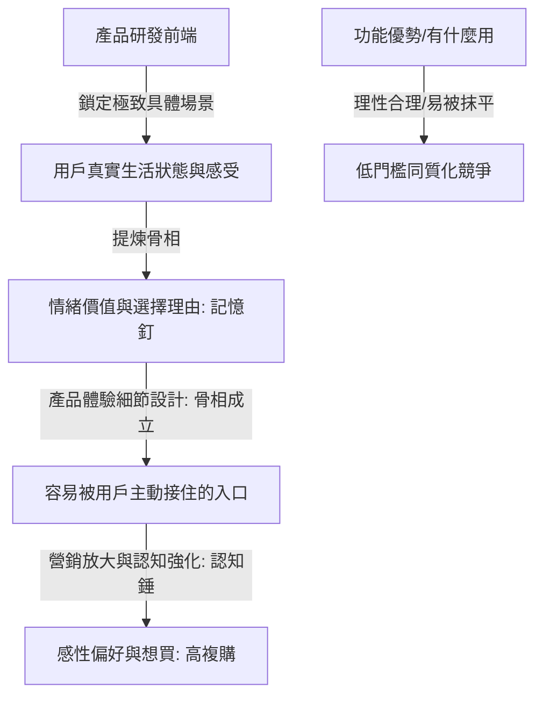

# 情緒消費不是賣情緒，而是讓產品從「有用」變成「想買」

## 核心洞察

情緒價值不是行銷後期貼上的糖衣，而是產品在開發前端就要設計進去的增長基因。真正的情緒價值是讓產品成為一個「容易被用戶主動放進生活裡的介質」。

## 重點摘要

## 值得深思的問題
1. 當功能賣點成為行業標配後，品牌的下一個差異化護城河會是什麼？
2. 「拒絕比需求更有價值」——你還觀察到哪些拒絕背後的真實生活壓力？
3. 如果你的產品明天被禁止使用「情緒價值」四個字做行銷，你還能用什麼方式讓消費者想買？
(待補充重點摘要)
賀大億深度剖析了新消費產品增長的核心瓶頸：企業習慣於將產品研發與情緒行銷割裂，導致行銷部門後期只能在一個骨相不成立的產品上硬編文案「補妝」。他指出，**「情緒價值不是行銷後期貼上的糖衣，而是產品在開發前端就要設計進去的增長基因」**。在基礎功能極易被快速抹平的今天，用戶的決策邏輯已從理性的「有什麼用（解決使用）」徹底轉向感性的「跟我有什麼關係（解決偏好）」。真正的情緒價值是讓產品成為一個**「容易被用戶主動放進生活裡的介質」**。這要求產品在研發前端必須鎖定極致具體的場景（如「下午三點撐住情緒的小獎勵」而非模糊的「年輕人喜歡」），並透過微觀體驗觸點將其固化為清晰的「選擇理由」（記憶釘），最後在市場端反覆敲擊（認知錘）。

## 關聯筆記
- [[2026-04-15-AI學習App Gizmo獲2200萬美元A輪融資：1300萬用戶的EdTech新模式|AI學習App Gizmo獲2200萬美元A輪融資：1300萬用戶的EdTech新模式]]
- [[2026-04-17-AI教育產品Gizmo三年用戶40倍融資2200萬美元|AI教育產品Gizmo三年用戶40倍融資2200萬美元]]
- [[2026-05-20-百萬台割草機器人背後：創辦人讓自己「變得不重要」|百萬台割草機器人背後：創辦人讓自己「變得不重要」]]

---
> [!TIP]
> 情緒不是行銷的糖衣，而是產品前端要設計的基因。
