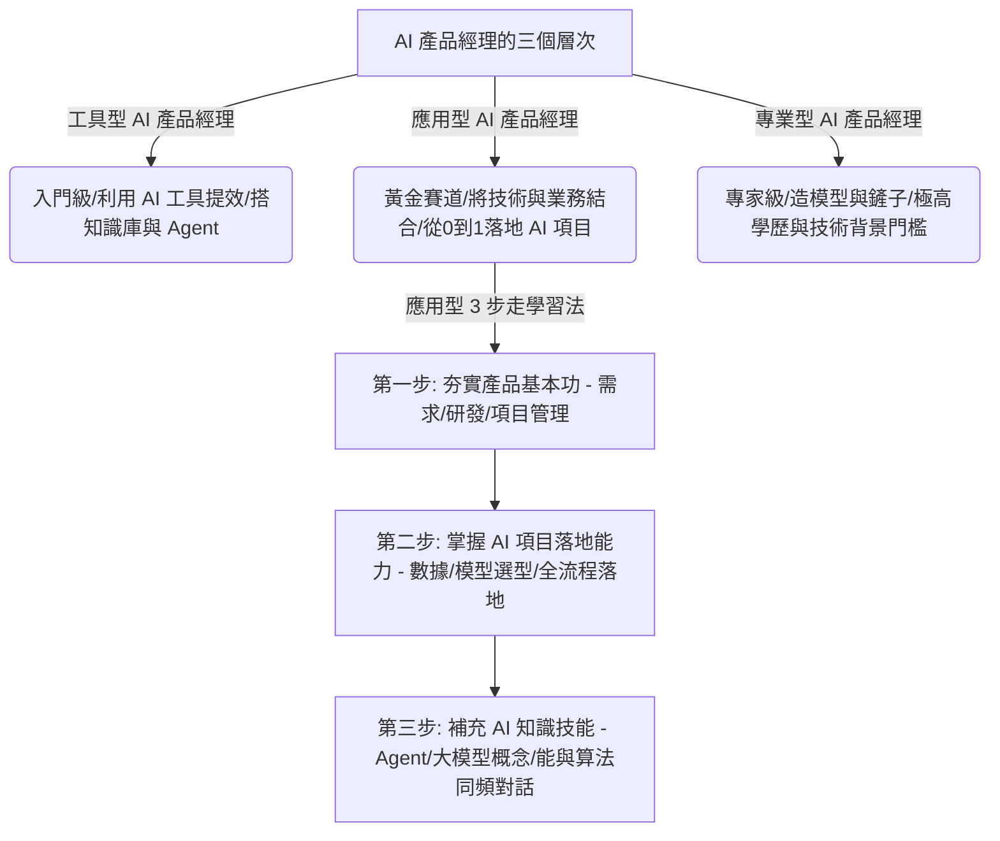

## 核心洞察
「未來所有的產品經理，都將是 AI 產品經理。」然而，90% 想轉行的普通人第一步就因陷入「盲目卷深度學習與神經網絡算法」的技術偏執而走偏。在 AI 打開個人天花板的去中介化時代，「工具型」提效與「專業型」造大模型皆是極端兩側，最適合普通人的黃金賽道是「應用型 AI 產品經理」——其核心能力依然是傳統產品思維（需求分析與業務理解）的「基本功」，加上主導一個 AI 項目從0到1落地的全流程「實戰經驗」，以及能夠與算法工程師「同頻對話」的前沿知識，而不是自己去敲代碼或訓練底層模型。

## 重點摘要

- **AI 產品經理的 3 個清晰分層**：
  - **工具型（入門級）**：將 AI 當作提效的「神兵利器」，熟練掌握搭建 Agent、知識庫，為未來人人必備的常識。
  - **應用型（黃金賽道）**：普通人的最佳切入點。核心是尋找技術與業務的結合點，要么用 AI 改造舊產品，要么從0到1孵化 AI 新功能或新產品。
  - **專業型（專家級）**：負責「造鏟子」研究底層大模型，對 985/211 碩博學歷與強悍技術背景有硬性要求，非此背景不建議盲目嘗試。
- **應用型 AI 產品經理的高效學習路徑**：
  - **產品思維是內核**：AI 僅是賦能的工具，需求分析、用戶研究與項目管理等產品基本功不過關，奢談 AI 只是空中樓閣。
  - **AI 項目落地為關鍵**：需要跟過一個完整的 AI 項目（從需求、方案、數據、模型選型到落地），了解項目落地全過程。
  - **技術補充是為了同頻對話**：學習 Agent、大模型等概念的目的是為了能與算法工程師高效對話，而非捲入複雜的算法研發中。

## 值得深思的問題
1. **「應用型」產品經理在 AI 時代的關係資產沈澱**：當 AI 讓「如何做（How）」的代碼研發與產品框架設計變得無比廉價且即時時，AI 產品經理的核心壁壘在於什麼？這是否說明，真正的壁壘不再是技術，而是創始人或產品經理在社會末梢對用戶「極致痛點」的「體驗感知力」與關係沈澱？我們在做商業模式諮詢時，如何引導創業者從「技術崇拜」轉向「關係資產」？
2. **「產品思維」作為通識教育的未來**：作者提出「未來所有的產品經理，都將是 AI 產品經理」。這是否意味著「產品思維」本身正在泛化為每位職場人（甚至文科生）在 AI 時代的「通識基本功」？我們如何利用 Cursor 等 AI 工具，將這種「發現問題、調用 AI 拼圖、HTML 快速交付成品」的能力，包裝為現代人的高效生存技能？
3. **「造鏟子」與「用鏟子」的生態博弈**：極高學歷和技術背景門檻的「專業型（造鏟人）」正面臨紅海肉搏與高昂算力成本，而低門檻、貼近業務的「應用型（用鏟人）」卻在各垂直行業悄然撿錢。這給想在 AI 生態中創業的素人或小團隊帶來了什麼戰略啟發？

## 關聯筆記
- [[2026-05-18-下一輪個人IP的紅利，就是把你的體驗變成錢|下一輪個人IP的紅利，就是把你的體驗變成錢]]：產品基本功與肉身試水溫的結合——AI 產品經理需要懂業務基本功，這與個人 IP 創業者必須依靠獨特的「生命體驗」和感知力在 AI 時代勝出，在本質上是一致的：工具由 AI 代償，靈魂由人類直覺定義。
- [[2026-05-14-為什麼你做的AI工具沒人買單？放棄宏大敘事，去社會的「神經末梢」撿錢|為什麼你做的AI工具沒人買單？放棄宏大敘事，去社會的「神經末梢」撿錢]]：同樣指明了「應用型 AI」的生路——不要去卷宏大的底層算法（造鏟子），而是去社會的神經末梢尋找具體痛點，用 AI 拼圖落地工具來降維解決問題。
- [[2026-05-18-Markdown 已死，HTML 登基：極客思維正在毀掉你的交付力|Markdown 已死，HTML 登基：極客思維正在毀掉你的交付力]]：這篇提到的「結果思維與交付力」是應用型 AI 產品經理的必備底層精神，用 AI 將技術轉譯為用戶能即時體驗的成品，而不是自嗨地研究極客代碼或神經網絡。

---
> [!TIP]
> AI的真正價值不在取代人，而在放大人的獨特判斷力。
