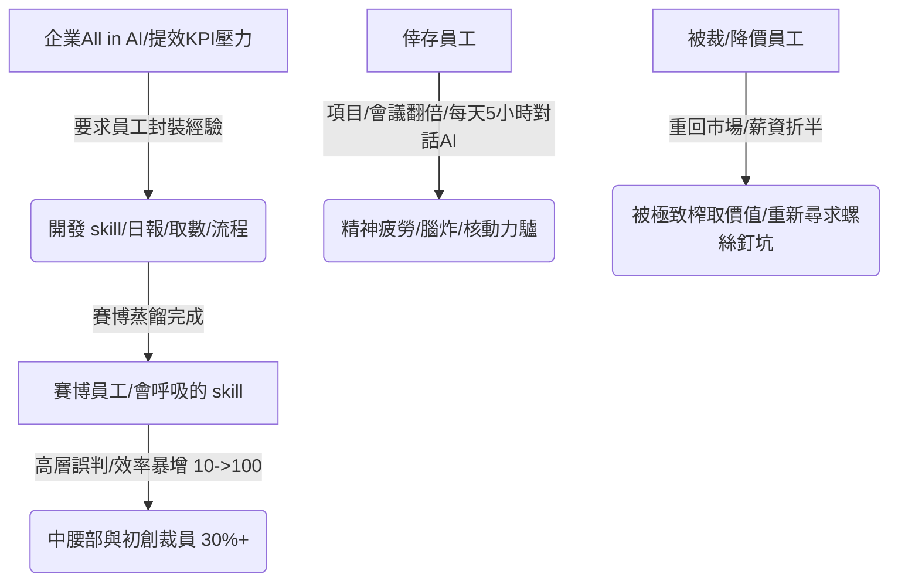

## 核心洞察
在「AI 提效」的宏大敘事下，打工人面臨著一場前所未有的「賽博獻祭」。當企業要求員工將個人的稀缺經驗封裝成標準化的「skill（自動化指令）」時，員工在不知不覺中為自己打造了「賽博絞刑架」。這場提效不僅沒有解放肉身，反而讓活人異化為點擊鼠標的「核動力驢」，在螺絲釘旋轉變快的洪流中，被降價、裁撤、抹去「靈魂」。

## 重點摘要

- **賽博蒸餾的絞刑架**：
  - 開源項目「同事.skill」的爆火，象徵著打工人經驗的「數位無機化」。公司要求員工將取數邏輯、工作流程、設計風格封裝為固定 skill（如葉筱的「會呼吸的 skill」），本質上是企業在榨取員工的「信任資產」與「實踐經驗」，最終讓領導或 AI 接管整個團隊，實現「自己開掉自己」。
- **工具支配人的「腦炸」與異化**：
  - **核動力驢的誕生**：效率從 10 飛到 100，一個人幹 10 個人的活，手頭項目從 3 個變 10 個，每天工作反而變長兩三個小時。
  - **精神疲勞（腦炸）**：HBR 調研顯示 14% 的員工因過度使用/監管 AI 產生「腦炸」，工作流從「解決問題」墮落為「管理工具」，深度思考被完全抹除。
- **指標自嗨與形式主義表演**：
  - 領導層將 AI 含量作為「政績」向上匯報，基層員工為了「AI 正確」不得不進行自嗨式表演：寫無意義的 AI 觀後感、開發一次性且無人下載的 skill、甚至沒有編程基礎的 PM 用 skill 寫出不合格的代碼塞滿庫房。
- **無情洗牌與溢價跌落**：
  - 矽谷與國內大廠因 AI 替代大舉裁員（如 IT 信息部一來就裁員 30%）。二次元運營林芊怡在被公司拆解、跑通、AI 模仿後被裁，該崗位重新招實習生時薪資直接減半，揭示了「經驗一旦被蒸餾，人的溢價便不復存在」的殘酷市場規律。

## 值得深思的問題
1. **「反蒸餾技術」與品牌靈魂的防線**：鄧小閒開發的「反蒸餾.skill」能清洗工作經驗、去掉乾貨只留廢話，在 GitHub 獲得極高收藏。作為品牌與生活方式顧問，我們如何在商業諮詢中為客戶建立「反蒸餾的靈魂護城河」？如何確保品牌的「活人感」與「現場靈光」不被廉價的 skill 技術徹底稀釋？
2. **「核動力驢」時代的用腦衛生與自救**：當 AI 讓項目推進速度翻倍、會議翻倍，個體電量面臨物理性耗盡。我們如何引導受慢性疲勞（ME/CFS）困擾的現代人，在「AI fluorescent（熟練度）沒得商量」的職場壓榨中，實施精細的能量 Pacing 管理，守護最後的身心輕盈？
3. **「越老越吃香」幻覺的破滅與技能資產管理**：財務、程序員等古典專業曾被視為長青職業，如今卻在 AI 面前最先被「公式化蒸餾」。作為知識工作者，我們如何重新定義自己的「動態資產」？當「會呼吸的 skill」能永遠為公司賣命時，我們如何擁有真正帶得走、無法被複製的「肉身智慧」？

## 關聯筆記
- [[2026-05-18-慢性疲勞纏上年輕一代，查不出任何病，但我的身體真的「壞了」|慢性疲勞纏上年輕一代：查不出任何病，但我的身體真的「壞了」]]：兩者互為因果——AI 的無限提效和 token 賽馬機制，正是將現代人逼入「腦炸（Brain rot）」、PEM 延遲惡化與慢性疲勞的底層制度絞肉機。
- [[2026-05-18-當身心與生活都在超載，我們該如何找回失落的輕盈|當身心與生活都在“超載”，我們該如何找回失落的輕盈]]：打工人在 AI 提效下從牛馬變成「核動力驢」，項目與會議成倍增長，正是需要進行「系統性精神與生活卸載」的極致反面教材。
- [[2026-05-18-橫店短劇大撤退，停工、降薪，與被擠掉的飯碗|橫店短劇大撤退，停工、降薪，與被擠掉的飯碗]]：AI 仿真人短劇（Seedance 2.0）用 1/5 成本消滅真人演員，與公司用 skill 蒸餾消滅程序員和財務，在本質上都是「用極低邊際成本的數字工具消滅高成本活人」的同源社會悲劇。

---
> [!TIP]
> 賽博蒸餾的殘酷真相在於：你越是毫无保留地將靈魂與經驗封裝成完美的 skill 獻給公司，你為自己打造的賽博絞刑架就越是無比堅固。在被 AI 壓榨成「核動力驢」的時代，唯有守住那一抹無法被算法公式化、有缺陷但真實的「活人溫度」，才是我們最後的防線。
