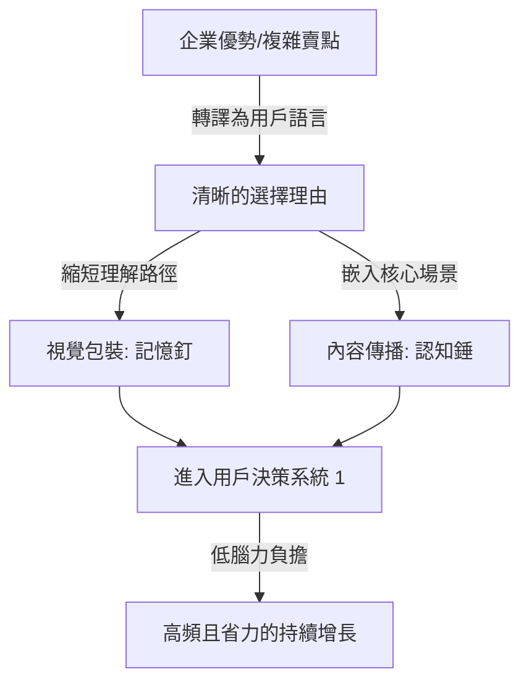

# 新消費下半場，品牌最大的成本是解釋成本

> [!TIP] 偷偷的溫暖釀造
> 很多時候，我們自滿於「把邏輯與細節交代得無比完整」，卻忘了客戶與消費者走在資訊洪流的便利店裡，他們的眼睛和腦袋已經累壞了。對泛人群而言，最大的溫柔是「替他們省下腦力」。與其給他們一堆需要理性解碼的 Markdown 原理，不如用直覺的「HTML 成品包裝」一次給予結果，把解釋成本降到零。

---

## 核心洞察

品牌最大的成本不是生產或流量，而是解釋成本。消費者在資訊過載下啟動腦力防禦機制，無法被快速理解的優勢就不會變成選擇理由。真正的低認知成本，是背後想得很深、前面說得很準。

## 重點摘要

## 值得深思的問題
1. 如果你的產品明天被禁止使用「情緒價值」四個字做行銷，你還能用什麼方式讓消費者想買？
2. 當產品本身的功能差異化越來越小，品牌的「選擇理由」應該從哪裡長出來？
(待補充重點摘要)

### 1. 資訊過載時代的「腦力防禦機制」
消費者每天面對無數的產品和內容衝擊，沒有耐心與時間去深度研究產品細節。很多新消費品牌增長卡住，表面上是流量、渠道或復購問題，底層核心在於**「用戶理解你太費勁」**——你把產品講複雜了，用戶就本能地啟動系統 2（理性但疲憊的系統），最終選擇逃離。

### 2. 決策的「系統 1」與「系統 2」在消費品的轉譯
*   **系統 1（直覺、情緒、快速）**：消費者 90% 的決策都在此發生。系統 1 討厭複雜，偏愛清晰、直接、低認知成本的直覺判斷。
*   **系統 2（理性、費力、緩慢）**：當賣點過多、解釋不清時，消費者被強行推入系統 2。一旦需要付出腦力去理解「好在哪裡」，理解負擔就會轉化為巨大的「選擇成本」。

### 3. 「企業語言」向「用戶選擇理由」的轉譯
品牌自豪的原料、專利、工藝、配方屬於「企業語言（賣點）」，但用戶只關心「這跟我有什麼關係（選擇理由）」。
*   *企業語言*：“我們這款飲料是0糖0脂0卡，採用了低溫冷泡工藝。”
*   *用戶語言*：“下午嘴饞又怕胖？這是一口能讓你放心享受的快樂水。”

### 4. 降低理解成本的產品表達系統

---

## 關聯筆記
- [[2026-04-08-一手評測｜Pomelli 開放台灣使用！怎麼用它做行銷創意素材？「產品攝影棚」好用嗎？|一手評測｜Pomelli 開放台灣使用！怎麼用它做行銷創意素材？「產品攝影棚」好用嗎？]]
- [[2026-04-18-玫瑰空調我不屑一顧，小貓空調我將全款購入！|玫瑰空調我不屑一顧，小貓空調我將全款購入！]]
- [[2026-04-08-2026年，一人公司最完整的系統打法｜保母級5步法|2026年，一人公司最完整的系統打法｜保母級5步法]]

---
> [!TIP]
> ## 精華金句
>
> 1.  **消費者不是不願意買好產品，二是不願意為理解你的好產品付出太多腦力。**
> 2.  **今天消費品競爭裡，最可怕的不是你沒有優勢，而是你的優勢無法被快速理解。優勢不能被快速理解，就不會變成選擇理由。**
> 3.  **真正的低認知成本，是背後想得很深，前面說得很準。沒有清晰的增長判斷，對外表達一定會混亂。**
> 4.  **用戶不是先理解你，再選擇你；用戶是因為理解你很輕鬆，才願意選擇你。**
>
> ---
>
> ## 延伸閱讀與知識關聯
> *   [[2026-05-18-Markdown 已死，HTML 登基，極客思維正在毀掉你的交付力|Markdown 已死，HTML 登基：極客思維正在毀掉你的交付力]]：Markdown 是需要費力解碼的「系統 2」，而成品化的 HTML 則是降維打擊的「系統 1」，極低解釋成本直接促成決策。
> *   [[2026-05-18-一句話+百元預算=百萬級廣告片，這個等式我們親測成立了|一句话+百元预算=百万级广告片，这个等式我们亲测成立了]]：Vidu Claw 影片智慧體直接將創意 Brief「HTML 化」為高精度的短影音成品，零解釋成本。
> *   [[2026-05-18-下一輪個人IP的紅利，就是把你的體驗變成錢|下一輪個人IP的紅利，就是把你的體驗變成錢]]：體驗派 IP 不裝、不演，用最真實的「活人感」直擊情感，用低認知成本和讀者建立高強度的情緒聯結。
