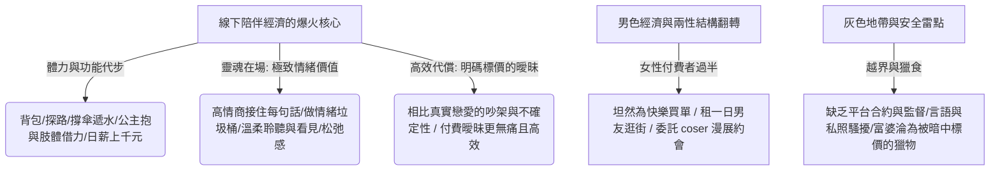

## 核心洞察
泰山陪爬、陪玩、戀陪本以及一日男友等線下陪伴服務的野蠻生長，精準揭示了：**「在真實關係充滿高消耗感、不確定性的現代都市中，『明碼標價的曖昧』正成為一種高效率、低內耗的情感代償。」** 消費者（特別是崛起中的女性付費群體）購買的，不只是背包與扶持的體力代步，更是高情商、每句話落地、兼具高顏值與肢體借力溫柔接納的情緒溢價（「談戀愛還得吵架，這個不會」）。然而，當情感與越界肢體觸碰被標價，這場缺乏合約與第三方監督的灰色交易，必然埋下深刻的安全雷點——**「你在挑選合心意的情感代償，對方卻在篩選你的銀行卡餘額；看似在消費男色的買單者，可能早已淪為被暗中標價的越界獵物。」**

## 重點摘要

- **明碼標價的曖昧與情感效率**：
  - 現代人的孤獨感已足以撐起一個龐大產業。真實戀愛需要應對爭吵、遷就與不可控的失望；而花 500 元請陪爬、陪玩，對方會從頭到尾保持微笑、誇獎、提供情緒垃圾桶功能。這種「明碼標價的無痛曖昧」成了低成本、高回報的選擇。
- **兩性結構翻轉與男色經濟**：
  - 付費陪伴市場的主導力量正在發生逆轉。女性付費用戶比例已突破半數，她們經濟獨立，越來越坦然地為「高顏值、八塊腹肌、會拍照、提供浪漫互動感」的男色消費買單（如戀陪本劇本殺、一日男友、Coser 角色委託約會）。
- **灰色邊界的獵物陷阱**：
  - 陪伴服務多基於口頭約定，缺乏第三方平台擔保與合約監督。在獨處山野、密閉房間等天然需要肢體借力的場景下，分寸極易失控。消費者自以為是掌控全域的買單者，卻因缺乏約束機制，極易在對方的餘額篩選系統中，淪為被暗中鎖定的「越界獵物」。

## 值得深思的問題
1. **「無痛關係」的成癮性與現實親密關係的退化**：當年輕人習慣了「花錢買高情商、百依百順的情緒代償」，他們對現實中「不完美、需要妥協與衝突」的真實關係之耐受度是否會進一步崩塌？作為用腦衛生與情緒管理顧問，我們該如何引導客戶在享受「無痛陪伴」的同時，不喪失在現實世界建立「有痛但真實的深度關係」的能力？
2. **非標陪伴服務中的「SOP 邊界化設計」**：既然陪伴經濟是未來巨大的藍海市場，那目前「缺乏合約、全靠口頭、容易越界」的痛點，是否孕育著新的商業機會？如何設計一套既能保留「情感溫潤顆粒度」，又能保障雙方人身與財產安全的「陪伴合規 SOP 體系」？
3. **「男色經濟」背後的女性悅己溢價定價權**：從「包裝情感劇場」到「購買一日男友」，女性在悅己消費上的付費意願已呈指數級增長。品牌在設計面向中產女性的產品與服務時，如何巧妙融入「被看見、被溫柔對待、被包容」的陪伴感元素，來換取更高的溢價空間？

## 關聯筆記
- [[2026-05-18-當身心與生活都在超載，我們該如何找回失落的輕盈|當身心與生活都在“超載”，我們該如何找回失落的輕盈]]：陪伴代償與身心自救——超載社會下的年輕人身心俱疲，在現實關係中無力社交內耗，因而選擇「明碼標價的陪爬與一日男友」作為無痛的情感物理按摩，以此在重壓下為心靈尋求片刻放鬆與輕盈。
- [[2026-05-18-老年大學裡的銀發攀比，老了也要內卷|老年大學裡的銀發攀比，老了也要內卷]]：晚年歸屬感與孤獨產業的呼應——退休老人湧入老年大學名利場進行身價內卷，本質上也是在都市鋼筋水泥孤島中尋求「社會歸屬感與看見」；這與年輕人花錢僱人陪爬、哄睡、Coser 約會以抵抗孤獨，在底層邏輯上完全一致，皆是轉型期社會中「情感關係資產匱乏」的微觀病理表徵。
- [[2026-05-18-一批未成年女孩，正在整頓健身圈|一批未成年女孩，正在整頓健身圈]]：女性主體性掌控權的躍升——女孩整頓健身圈追求的是對身體野性力量的主動掌控；而在陪爬與男色經濟中，女性消費者坦然為男色與溫柔買單，同樣展現了女性在經濟獨立後，主動定義自身欲望、追求主體掌控權的生活方式轉變。

---
> [!TIP]
> 情緒不是行銷的糖衣，而是產品前端要設計的基因。
