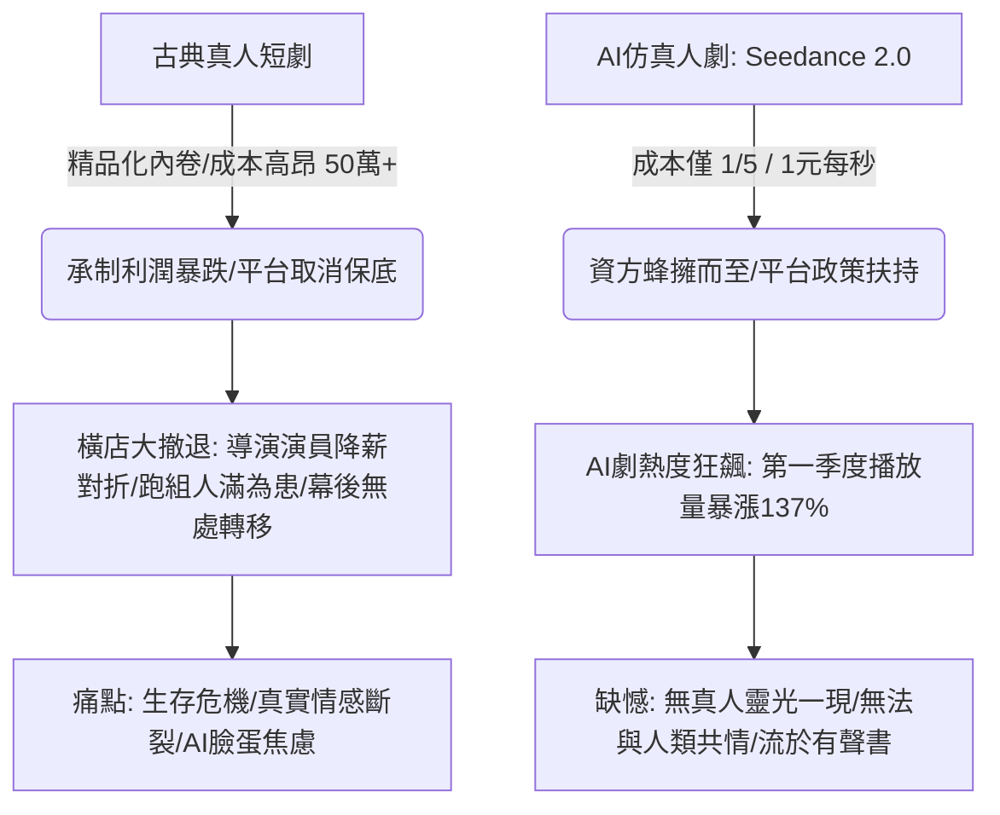

## 核心洞察
橫店短劇的冷清與 AI 仿真人劇的狂飆，是一場極致的「極低生產成本（AI）對抗高情感顆粒度但高風險（真人）的古典產業替代」。當平台取消保底、精品化內卷加重時，資本毫不猶豫地擁抱了成本僅 1/5 且生產可控的 AI。然而，AI 完美的臉蛋卻缺乏了真人演員「現場碰撞的靈光一現與情感共鳴」。在效率與真實的博弈中，真人溫度的稀缺性正在被重估。

## 重點摘要

- **大撤退的冰冷現實**：
  - 春節後橫店極度冷清，中小型與中腰部劇組大面積停擺。紅果取消真人短劇成片保底，直接擊垮了中小承制方的信心。
  - 導演與演員報價普遍「對折」，熟人社會的友情價失效。許多演員和幕後人員離開橫店，或在網吧打遊戲消磨時光。幕後團隊（攝影、燈光、道具）受到的衝擊比演員更大，因為其技能與器材更難橫向轉移。
- **AI 劇的狂飆突進**：
  - 字節推出 **Seedance 2.0**，60秒生成電影級短片，純生成模式單條成本僅 15 元（約 1 元/秒），團隊規模從 30 人驟降至 5-7 人，資金投入僅真人劇的 1/5 且過程更為可控。
  - 紅果等平台給予 AI 仿真人劇高達 40-60 的分成分數。AI 短劇《菩提臨世真人AI版》超越真人劇登頂熱度榜第一。
- **效率與共情的撕裂**：
  - **缺乏現場靈光一現**：AI 僅能根據現有素材庫進行二次創作，無法實現像真人演員在片場主動提議將反派角色處理成黑色幽默的「即興化學反應」。
  - **無法共情人類**：AI 的完美臉蛋與流淚表演無法打動觀眾，「AI 哭得再慘都毫無波瀾，乍看好看，但無法共情。」

## 值得深思的問題
1. **「真人味兒」作為一種溢價資產**：當 AI 能夠以 1/5 的成本批量製造毫無瑕疵的完美視覺時，「完美」本身就貶值了。在這種技術背景下，我們如何為文旅目的地、線下空間和生活方式品牌塑造「不完美但真實」的「真人味兒」？這種粗糙但具備真實溫度的情緒價值，是否會在未來成為一種昂貴的奢侈品？
2. **古典文藝創作者的技術退路與尊嚴**：白浪導演等創作者為了生存，將選角、選景、服化道全部移入電腦，雖然效率極高，卻「沒有了現場大家一塊去完成一個項目的感覺，非常折磨」。在技術重構生產力的時代，創作者應如何在「降本增效的妥協」與「實體創作的尊嚴」之間找到精神上的平衡點？
3. **被遺忘的底層勞動者與社會安全網**：攝影、燈光、場務等體力與器材重度依賴的幕後人員在這一波技術替代中「沒有別的行業能轉，器材都只能入庫」。當 AI 替代掉體力與技術雜役時，我們該如何為這些無法迅速「知識化、數位化」的古典產業底層勞動者，設計出可行的轉移通道？

## 關聯筆記
- [[2026-05-18-慢性疲勞纏上年輕一代，查不出任何病，但我的身體真的「壞了」|慢性疲勞纏上年輕一代：查不出任何病，但我的身體真的「壞了」]]：AI 的冰冷算法在極度榨取創作效率，而橫店演員與幕後人員面臨的「極度焦慮與無所事事」，正是超載社會中個體面臨慢性疲勞與存在感危機的產業投影。
- [[2026-05-18-當身心與生活都在超載，我們該如何找回失落的輕盈|當身心與生活都在超載，我們該如何找回失落的輕盈]]：AI 技術的狂飆正在加劇整個內容產業的超載，而人類在完美視覺圍剿下，尋求的「真人味兒」與「情感共鳴」，正是那份失落的身心輕盈。
- [[2026-05-18-韓國時尚卷王殺入中國，3家店開局就火，放話要再開100家|韓國時尚卷王殺入中國，3家店開局就火，放話要再開100家]]：對比 Musinsa 透過精準的情緒溢價（韓劇氛圍）賣大眾基礎款，AI 劇也是在用完美的氛圍感（1/5 的成本）進行降維打擊，兩者都揭示了「氛圍感」作為情緒生產力的極致效能。

---
> [!TIP]
> AI的真正價值不在取代人，而在放大人的獨特判斷力。
