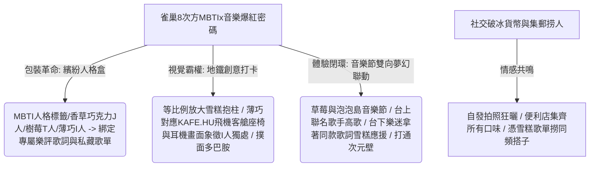

## 核心洞察
一盒定價幾元、用來消暑的普通巧克力雪糕，如何爆改為引發全網集郵收集、撈人同頻社交的「夏日現象級社交現場」？雀巢 8 次方以「MBTI（人格標籤） × 獨立音樂（情緒歌單）」的雙重綁定，給出了懂王級的實踐答案：**「當品牌將產品包裝從單純的功能性容器，重構為與用戶人格密碼、審美氣質 100% 匹配的情緒嘴替時，產品就成了最絲滑的社交破冰貨幣。」** 線上治癒 TVC、地鐵站等比例放大雪糕口味場景的「I/E/P/J 打卡抱柱」（如薄巧口味對應飛機客艙與耳機象徵 I 人自我獨處沉浸），與草莓音樂節「台上聯名歌手熱力開唱，台下樂迷手握同款歌詞雪糕打 Call 應援」的雙向夢幻聯動，完美示範了**「包裝作為微觀情緒劇場與內容存取接口」**的核心張力。

## 重點摘要

- **MBTI × 專屬歌單的「人格綁架」包裝**：
  - 雀巢 8 次方把 MBTI 玩成了年輕人的社交嘴替。每一種口味對應一種人格狀態與一位獨立音樂人（馬頔、李大奔、聲音碎片、阿肆等）的專屬歌單與歌詞。香草巧克力味的 J 人歌單寫著「他孤独，可是无限清醒」，薄巧口味對應 KAFE.HU 說唱，讓人在拆雪糕時產生「有人把我的私藏歌單和精神狀態印在包裝上」的強烈代入感。
- **地鐵創意視覺與情緒開窗**：
  - 在上海人民廣場地鐵站，將雪糕等比例放大成巨型抱柱，以鮮明色彩標註「I/E/P/J 人打卡點」。視覺設計與口味、人格高度契合，例如薄巧口味抱柱上，飛機座椅與耳機的插畫極致外化了 I 人的「沉浸與空白感」，成為天然的「打卡收割機」。
- **音樂節的雙向夢幻聯動**：
  - 品牌直接帶著產品殺入夏日快樂老家——草莓音樂節與泡泡島音樂節，設立巨型毛絨互動區。最絕妙的是，包裝聯名的音樂人正是現場的表演嘉賓。台上傾情演唱，台下樂迷一邊吃著冰淇淋、一邊對著同款歌詞雪糕瘋狂應援打 Call，實現了產品與體驗現場的次元壁擊穿。

## 值得深思的問題
1. **「包裝即應援周边」的產品溢價邏輯**：雀巢 8 次方證明了，當包裝上承載了具體文化圈層（如獨立搖滾、說唱）的「精神圖騰」時，雪糕就不再是消暑食物，而成了應援周邊。在非標文旅或本土品牌創生中，我們如何為當地的農特產品、伴手禮設計類似的「文化/情緒接口」，讓消費者為「集郵和尋找同好」而自發溢價買單？
2. **「MBTI」标籤的生命週期與下一個社交標籤的捕獲**：MBTI 作為社交標籤已經風靡了數年。當 MBTI 的新鮮感逐漸衰退時，我們該如何利用 AI 工具敏銳捕獲年輕人的「下一個精神狀態共識」？什麼會是下一個能代替 MBTI 進行「人格歸類與自我表達」的社交密碼？
3. **「線上共鳴與線下活體在場」的整合交付**：很多品牌的行銷「線上熱鬧，線下冷清」，或者「線下擺攤，線上無聲」。雀巢 8 次方將「歌詞包裝-地鐵抱柱-音樂節表演-同款歌詞應援」串聯成一條密不透風的活體在場鏈條。我們在為客戶策劃品牌戰略時，如何確保「線上內容（HTML 視覺體驗）」與「線下物理在場」的無縫銜接與情感閉環？

## 關聯筆記
- [[2026-05-18-飲料瓶裡的故事，你得喝完才看得到|飲料瓶裡的故事，你得喝完才看得到]]：包裝作為情緒劇場的二度重疊——可爾必思單戀瓶與 Seki Milk 漫畫牛奶瓶利用液體透明物理遮擋講述喝完才看得到的微觀故事，而雀巢 8 次方則利用「MBTI×專屬音樂人歌詞」直接把雪糕包裝爆改成社交應援周邊，兩者都在實踐「包裝是低成本、高頻、直達消費者的第一體驗劇場」這一核心品牌戰略。
- [[2026-05-18-韓國時尚卷王殺入中國，3家店開局就火，放話要再開100家|韓國時尚卷王殺入中國，3家店開局就火]]：品牌包裝與中產精緻包裝的「裝備鄙視鏈」——韓國卷王用精美的空間與潮人包裝吸引打卡攀比，老年大學老人用高檔相機與 1000 元演出服進行財富閱兵。兩者均揭示了轉型期社會中，大眾習慣用外在的「裝備/包裝」去掩蓋內在安全感的缺失與空虛。
- [[2026-05-18-Markdown 已死，HTML 登基：極客思維正在毀掉你的交付力|Markdown 已死，HTML 登基：極客思維正在毀掉你的交付力]]：視覺霸權與結果交付的勝利——雀巢 8 次方放棄了乾巴巴的口味說明書邏輯，直接用五彩斑斕的地鐵巨型抱柱、多巴胺配色、以及音樂節雙向應援的成品畫面，向年輕人直接交付了一場「驚心動魄的夏日音樂節體驗」，這正是「HTML 登基/視覺表現力即是第一生產力」的經典行銷外化。

---
 > [!TIP]
 > 別再用「產品說明書」式的乾巴巴邏輯向用戶兜售你的產品了。在情緒溢價的時代，一盒雪糕不只是消暑的冰水，而是用戶靈魂歌單的「物理載體」和社交破冰的「互聯網嘴替」。當你學會把枯燥的產品細節藏進 MBTI 與獨立樂評的情緒劇場裡，讓消費者在音樂節狂歡的在場中為你的包裝拍照集郵，你的品牌就穩穩地闖入了他們的文化腹地。
