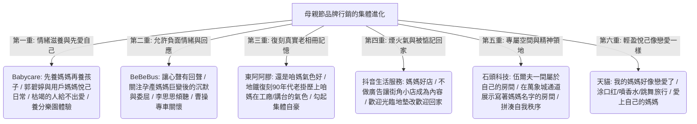

## 核心洞察
傳統的節日行銷總陷入「單向感恩、道德綁架式歌頌付出」的煽情套路中。而今年母親節各大品牌的走心傳播，有力昭示了商業倫理與情感連接的集體進化：**「從歌頌奉獻轉向看見主體性——看見媽媽作為獨立個體的悅己覺醒、情緒滋養與精神自救。」** 這些案例實踐完美證明了：一個乾涸、被家庭時間與空間撕碎的靈魂是給不出愛的；只有先滋養、填滿好媽媽自己，愛才能自然流向孩子與世界。不論是「先養媽媽，再養孩子（Babycare）」、「還是咱媽氣色好（東阿阿膠）」復刻 90 年代老相冊的自豪記憶，還是商場通道展示媽媽專屬精神領地的「一間只屬於自己的房間（石頭科技）」，都是**對中產階級焦慮內耗的溫柔卸載，將品牌退位為真實生活的見證者與療癒港灣**。

## 重點摘要

- **先養媽媽，再養孩子（Babycare）**：
  - 媽媽的愛，來自自我被充盈。Babycare 倡導「先滋養、愛自己」，呈現媽媽們畫畫、奔向日出、大笑的悅己日常。一個內心乾涸的人給不出愛，只有自己先被填滿，才有餘力托舉他人。線下「Mamaland 養分樂園」讓媽媽們暫時放下身份，只做自己。
- **還是咱媽氣色好（東阿阿膠）**：
  - 當大眾追逐新潮濾鏡，東阿阿膠退回 90 年代的老掛歷。最健康氣色好的人不在小紅書裡，而在家裡的老相冊裡。一句從社交平台撿來的民間感嘆「還是咱媽氣色好」，復刻泛黃紙張和田野工廠媽媽的鮮活，極具集體記憶情感穿透力。
- **一間屬於自己的房間（石頭科技）**：
  - 石頭科技致敬弗吉尼亞·伍爾夫「一個女人如果要寫小說，必須擁有自己的房間」。在羅湖萬象城通道將媽媽們的多重身份（畫家、攝影師、詩人）化為實體公共裝置，提醒大眾——當媽媽的時間和空間被家庭切割成碎片時，她需要一個完全屬於自己、寫著自己名字的獨立物理和精神領地。
- **媽媽好店與被惦記的煙火（抖音生服）**：
  - 散落在街角不起眼的小店，老闆娘會像媽媽一樣叮囑你好好吃飯、把飯壓實。抖音不做廣告，讓店本身成為內容。線下將地墊替換為「歡迎回家」，讓漂泊的年輕人在煙火氣中獲得被看見、被治癒的真實溫暖。

## 值得深思的問題
1. **「不歌頌只看見」在 B2C 品牌中的範式移轉**：在過去的行銷範式中，品牌習慣當一個「說教者、指導者」，告訴消費者應該如何感謝、如何做一個完美的人。而今年母親節案例證明，品牌退位為「傾聽者、看見者、實物支持者」，反而能換取極高的品牌信賴與情緒 ROI。這對於我們為本土商業、非標地產做品牌定位時有何啟示？如何把「強推產品」爆改成「看見消費者的真實在場」？
2. **伍爾夫的「專屬房間」在第三空間設計中的實體化**：石頭科技將「媽媽的房間」作為商場通道裝置，精準擊中了媽媽時間空間被切割的痛點。這對未來城市商業空間、社區空間有何啟發？我們是否能為女性、超載的中產白領，在百貨、書店或文旅街區中，設計一個物理和精神上的「感官空白與秩序拼湊小屋」？
3. **民間感嘆「撿文案」的傳播槓桿**：東阿阿膠的「還是咱媽氣色好」並非大師原創，而是從社交平台民間對話裡「撿」來的。這對我們寫作和蒸餾知識有何啟發？我們該如何建立自己的「民間語言敏感度」，從日常碎片中捕獲那些具備極強穿透力、沒有管理黑話與官僚味的「大實話」？

## 關聯筆記
- [[2026-05-18-當身心與生活都在超載，我們該如何找回失落的輕盈|當身心與生活都在“超載”，我們該如何找回失落的輕盈]]：兩者都在探討「如何卸下系統性重壓，溫柔修復自我主體性」——超載社會需要輕盈小屋與能量 Pacing Pacing 卸下負擔，而母親節行銷則透過「養分樂園、讓孕產心聲有回聲、提供一間屬於自己的房間」來幫助女性卸下奉獻枷鎖、尋求輕盈悅己。
- [[2026-05-18-熬過1480天的大廠人，不再渴望上岸|熬過1480天的大廠人，不再渴望上岸]]：拒絕被工具修剪的自救實修——大廠人張小滿拒絕戰術性懷孕的算計，以素人寫作和老實散步自救，這與 Babycare 宣導「先養媽媽再養孩子/拒絕為了家庭奉獻而榨乾自我」、BeBeBus 允許媽媽有負面情緒在精神內核上高度契合——皆是拒絕被系統工具化閹割，努力捍衛活人感的自我救贖。
- [[2026-05-18-飲料瓶裡的故事，你得喝完才看得到|飲料瓶裡的故事，你得喝完才看得到]]：微觀情緒與體驗載體的傳遞——飲料瓶透過透明物理遮擋設計連載漫畫提供情緒彩蛋，而母親節行銷（抖音生服）透過將「歡迎光臨地墊改為歡迎回家地墊」的微觀動作，同樣是把平庸的零售媒介打造成提供溫暖與社交關懷的情緒開窗，小動作起到了巨大的情感槓桿。

---
> [!TIP]
> 枯竭的靈魂給不出真正的愛。別再用道德綁架的宏大誓言去歌頌別人的奉獻了，那只是一副美麗的沉重枷鎖。在這個人人都被系統切割成碎片的時代，溫柔地卸下他們的重擔，遞上一杯熱茶，為他們在喧囂的萬象城商道中搭建一間「只寫著自己名字、只屬於自己」的房間。看見並滋養主體性的真實在場，才是行銷與陪伴最極致的人文溫度。
