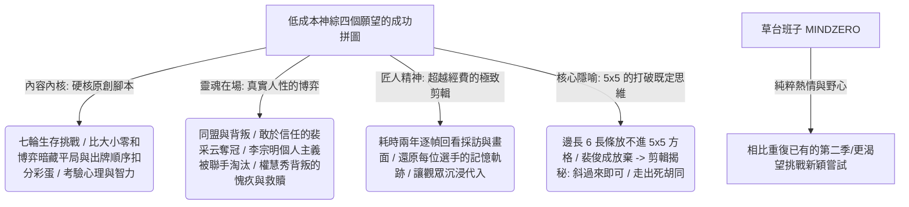

## 核心洞察
一檔無明星站台、無精良服化道、用租來別墅且鏡頭偶爾失焦、冠軍獎金僅 1 萬多人民幣的大學生「草台班子（MINDZERO 工作室）」低成本素人綜藝《四個願望》，憑什麼在豆瓣取得 9.4 的神級高分？它有力地證明了：**「在注意力粉塵化與經費至上的時代，優秀的原創內容腳本與真實的人性戏剧衝突，能對精美的包裝與宣傳堆疊進行降維打擊。」** 創作者金興寧傾盡所有的純粹熱情、不為盈利重複的創作野心，以及用兩年時間逐幀回看復原選手記憶軌跡的「匠人剪輯」，成就了極致的「結果交付」。裴俊成拼圖遊戲因被 5×5 框框限制而放棄，後期剪輯點出「長條斜過來即可放入」的奧秘，更是一次打破既定思維死胡同的終極隱喻。

## 重點摘要

- **內容腳本對經費的降維打擊**：
  - 《四個願望》沒有精美的布景，選手光腳穿一次性拖鞋在別墅錄製。但其靈魂在於精妙的「原創遊戲規則與隱藏機制」（如第一輪零和博弈比大小中，平局雙方得分、出牌出錯扣分以達成「背叛者」和「同路者」任務），激發出智商與人性底牌的極致撕扯。
- **智鬥與難測的人心博弈**：
  - 博士生李宗明（魔方紀錄保持者）用 5 分鐘破解全部隱藏規則，是無可爭議的天才；但他個人主義的打法風格導致在決賽前被其餘三人聯手淘汰。
  - 裴俊成努力思考卻總被利用，在被多次背叛後喪失信心，最終放棄拼圖。權慧秀在利益衝突下背叛了盟友裴采云，卻因愧疚向裴俊成送出特殊道具，展現了複雜而動人的人性溫度。
- **5×5 方格的思維死胡同與匠人剪輯**：
  - **思維隱喻**：拼圖遊戲中，將長條塞入 5×5 方格。選手被「邊長為 6 無法放入」的直覺既定思維所困而放棄。其實，**只要把長條斜過來，就能全部放入**。
  - **匠人剪輯**：11 人的大學生團隊身兼數職，不懂廣播電視卻耗時兩年，逐幀比對畫面與採訪以復原選手的記憶軌跡，為觀眾打造極致沉浸的解謎懸念。

## 值得深思的問題
1. **「草台班子」對中產階級「資源崇拜」的降維打擊**：在職場與創業中，人們常把「經費不足、沒有明星、設備不好」當作無法交付好作品的藉口。但《四個願望》證明，只要對內容腳本和交付品質有純粹的野心，簡陋的別墅也能生長出偉大作品。我們在做個人 IP 或業務創新諮詢時，如何引導創業者戒斷「配齊裝備才肯下場」的完美主義拖延？如何用最輕量、最核心的「內容靈魂」快速交付結果？
2. **「斜過來的 5×5 拼圖」在商業決策中的應用**：當我們面對紅海競爭或人生困境時，大眾往往像裴俊成一樣，死死盯著 5×5 方格的邊界，認為邊長為 6 的方案絕無可能，從而選擇放棄。在商業諮詢中，當客戶說「這個市場已經沒有機會、這個產品放不進去」時，我們如何協助他們把方案「斜過來」？如何幫他們打破思維的既定邊界？
3. **「不為盈利重複」的創作野心半衰期**：MINDZERO 工作室在爆紅後收到無數邀約，卻拒絕重做第二季，而是選擇挑戰全新嘗試。這種在巔峰期「克制重複、保護好奇心」的戰略定力，對於追求可複製規模化、容易落入俗套的互聯網流量商業有何啟示？

## 關聯筆記
- [[2026-05-18-Markdown 已死，HTML 登基，極客思維正在毀掉你的交付力|Markdown 已死，HTML 登基：極客思維正在毀掉你的交付力]]：極致的結果交付與用戶體驗——大學生團隊用兩年逐幀剪輯復原記憶軌跡，這與 HTML 登基所倡導的「拋棄過程思維、用五彩斑斕的直觀體驗直接交付結果」在內容交付的本質上完美契合：不要跟用戶解釋你有多努力，直接給他驚心動魄的體驗成品。
- [[2026-05-18-低谷期突圍最快的方式：換！換！換！|低谷期突圍最快的方式：換！換！換！]]：換腦格式化思維——裴俊成在 5×5 拼圖中的既定思維死胡同，與人在低谷期時死守舊認知不放、死熬不換的狀態如出一轍。只要肯「格式化換腦」、把眼前的拼圖「斜過來」，困局立刻迎刃而解。
- [[2026-05-15-與陳嘉映閒聊越少關注自我自我就越舒展|與陳嘉映閒聊：越少關注自我，自我就越舒展]]：MINDZERO 工作室團隊不以盈利為目的、為愛發電，傾盡純粹熱情挑戰新穎嘗試，這與陳嘉映所說的「當你越少關注自我的利益算計與內耗，將自我投身到一件具體且熱愛的事情中，自我反而會無比舒展與強大」達成了精神共鳴。

---
> [!TIP]
> 所有的情緒問題，背後都是邊界問題。
