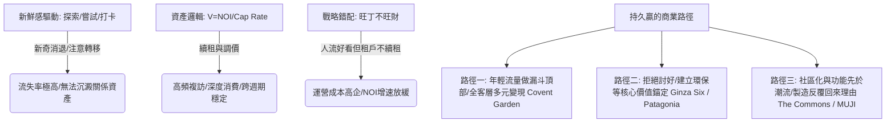

## 核心洞察
「追年輕人」容易火，因為年輕人是趨勢的定義者與傳播的發動機；但不持久，因為年輕人本質上是「新鮮感驅動」而非「忠誠度驅動」的消費者。商業地產與品牌常掉入「旺丁不旺財」的陷阱，本質上是「一次性新奇感（運營邏輯）」與「可積累的關係資產（資產邏輯）」之間的時間觀錯配。真正持久贏的商業，都把年輕人當作「流量的入口」，而非「變現的終點」。

## 重點摘要

- **年輕人是趨勢引擎，也是新奇詛咒**：
  - **趨勢發動機**：數位化時代消費傳導逆轉，年輕偏好向上重塑社會期望。Supreme 將限量發售做成注意力機器，吸引年輕人社交行為自發傳播。
  - **新奇與過時同源**：年輕人追求探索大於積累。A&F 在 2000 年代極致押注 15-22 歲客群，當這代人長大，品牌無法隨之進化，反被年輕人貼上「父母那一輩的東西」標籤而衰落。Diesel 的反叛表達機制也面臨「持續新鮮」成本指數上升的困境。
- **商業地產的 NOI 痛點與時間錯配**：
  - 商業地產的估值（V=NOI/Cap Rate）要求租金可持續提升，這依賴高頻複訪、深度消費、跨週期穩定的優質客群。
  - 隨著 15-34 歲年輕人口持續收縮，搶奪年輕流量的成本劇增，而 45-60 歲高淨值穩定客群卻在購物中心裡「系統性缺席」，導致極端的「旺丁不旺財」。
- **持久贏的三大複用路徑**：
  - **流量漏斗化（Covent Garden）**：倫敦科文特花園用平價餐飲與廣場吸引年輕人製造聲量與人流密度，但變現主體是 Chanel、Dior 等高端零售。Lululemon 以年輕瑜伽社群為入口，但護城河是產品質量讓客群跟著品牌一起變老（覆蓋 25-55 歲）。
  - **價值仰望化（Ginza Six / Patagonia）**：東京 G6 拒絕快時尚，堅持服務 35-55 歲高淨值群體，地價租金跨週期上升。Patagonia 不追熱點，用反消費主義價值觀錨定忠誠度極高的跨代際消費者。
  - **社區與功能化（The Commons / MUJI）**：曼谷 The Commons 用公共空間與生活方式將商場做成「日常社區」，製造反覆回來的理由。MUJI 以極簡功能先於潮流，讓消費者在 20 歲、成家、中年後都能產生真實的生活黏性。

## 值得深思的問題
1. **台灣文旅街區與「銀座六丁目」仰望模式的啟發**：台灣很多老街與歷史街區（如大稻埕、中山七三）在改造時，極易流於引進文創快閃店、文青咖啡館等「討好年輕人打卡」的同質化業態，導致平日冷清、週末旺丁不旺財。我們是否能大膽引入「Ginza Six 模式」，不追逐社交打卡熱點，而是精準錨定台灣 45-60 歲、具備極高消費力且長情的中產高淨值人群，打造高雅、舒緩的慢生活心智？
2. **「漏斗設計比入口重要」在非標商業的落地**：如果我們將「年輕活力」作為引流漏斗的頂部，我們該如何為地方創生項目或非標空間設計「變現漏斗」？如何防止年輕流量在中途漏光，而無法為空間內的優質本地零售與高端餐飲提供有效的 NOI 支撐？
3. **MUJI 模式對台灣地方特產與品牌化的解毒**：台灣許多地方創生品牌在設計包裝時，往往過度追逐潮流「網紅風」，卻忽略了「功能先於潮流」的日用底色。我們如何引導台灣地方品牌學習 MUJI 和 The Commons，將產品與空間深深植入顧客日常生活的「第一百次使用」中？

## 關聯筆記
- [[2026-05-18-鄭州商業，實用主義的極致演繹|鄭州商業，實用主義的極致演繹]]：兩者高度互補——鄭州丹尼斯大衛城能將重奢 LV 與 B1 美食街、L13 牙醫理髮完美雜糅，本質上就是用「極致省心的日常實用主義（MUJI式的第一百次回來）」，完成了全客層、跨週期的變現漏斗設計。
- [[2026-05-18-韓國時尚卷王殺入中國，3家店開局就火，放話要再開100家|韓國時尚卷王殺入中國，3家店開局就火，放話要再開100家]]：Musinsa 的爆火印證了年輕流量作為「趨勢發動機」的驚人威力，但它在快速擴張中面臨的挑戰，正是本篇所指出的「如何防止新鮮感半衰期縮短、將韓風標籤沉澱為跨週期關係資產」的致命課題。
- [[2026-05-18-快閃，正在成為商場的主菜|快閃，正在成為商場的“主菜”]]：快閃的火爆正是年輕人「新鮮感驅動、首次打卡」消費習慣的體現。如果商場只把快閃當主菜，會因缺乏「跨週期關係資產」而陷入不斷刷新、成本上升的 Diesel 式泥潭。

---
> [!TIP]
> 沒有洞察的行銷，只是比較貴的噪音。
