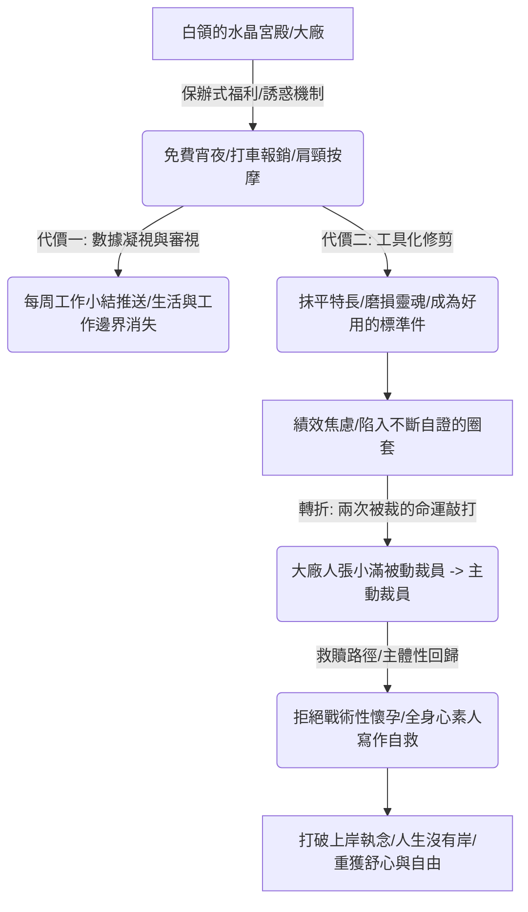

## 核心洞察
大廠被奉為「白領的水晶宮殿」，其提供的「保辦式福利（免費宵夜、報銷打車、心理諮詢）」本質上是高度誘惑的加班捕鼠器，建立起一種無孔不入的「數據凝視與凝視審查」。大廠考核機制的底層邏輯，不是鼓勵個人的獨特與創造力，而是將活人修剪為可任意調用、好用的「標準件」。張小滿的兩次被裁與《大廠小民》的素人寫作實踐證明：在系統性異化的高壓磨損下，唯有徹底打破「尋求上岸」的執念，回歸到老實散步、運動與自我寫作的真實生活，才是找回主體性尊嚴的唯一出路。

## 重點摘要

- **白領水晶宮殿的隱形凝視**：
  - 大廠像一棟封閉垂直的摩天大樓或五星級酒店，包辦了食堂、健身房、班車乃至心理諮詢等日常一切所需。這種極致的便捷讓人幾乎不需離開大樓。
  - **加班與福利的詭異捆綁**：夜間十點後的免費夜宵與打車報銷，誘使人自願延長工時。每週五工作 App 推送的會議、對話、加班與步數數據，建立起「後面有一雙眼睛在凝視」的隱形審視，磨損了日常生活的邊界。
- **標準件的修剪邏輯**：
  - 上級要求「提高綜合能力，成為各方面都很強的人」，實質上是要將員工修剪成可以隨時替換、沒有稜角的「標準件」，而非鼓勵發揮長處與個人創造力。這導致表面的精英光環與內心的靈魂貧瘠形成巨大落差。
- **寫作實修與打破上岸執念**：
  - 面對「戰術性懷孕」避裁的戰略算計，張小滿本能拒絕掉入下一個算計陷阱，堅決不在身心受創時生育。
  - **人生沒有岸**：在經歷兩次被裁後，張小滿透過全身心且高頻的素人寫作（《大廠小民》）與自我對話，恢復散步、運動，讓身體活過來。她篤定人生沒有岸，拒絕再回坐班職場當「牛馬」。

## 值得深思的問題
1. **「大廠黑話」的傳播與心智污染**：張小滿指出「大廠黑話（如打法、拉齊、引爆點）」早已氾濫於非大廠的日常語境。這種極度追求效率、去情感化的「管理語言」，如何暗中侵蝕了現代人的語言敏銳度與靈魂顆粒度？我們在寫作與諮詢中，該如何刻意「防禦黑話污染」，用更有溫度、更鮮活的「大實話」重建與人深度的情感聯結？
2. **「戰術性算計」與「真舒心生活」的抉擇**：在大廠高壓下，許多女性迫於無奈選擇「戰術性懷孕」。這種將新生命當成職場防禦工具的「戰略算計」，反映了系統對人性的極度壓迫。作為諮詢者，當面對客戶面臨類似「算計與身心崩潰」的兩難境地時，我們該如何協助他們評估「心力與靈魂的折舊成本」？如何給予他們走出系統的勇氣？
3. **「老實寫作」作為數位游牧的自救儀式**：張小滿將寫書當成每天按時按量的項目來做，以此在無坐班狀態下建立「自我秩序」。對於擺脫系統的超級個體或自由職業者，這種「以寫作代坐班」的秩序重建有何啟示？我們如何透過「老實寫作與知識蒸餾」，在無岸的生活中，為自己搭建一座堅固的心靈港灣？

## 關聯筆記
- [[2026-05-18-工作毀掉了我美好的人性|工作毀掉了我美好的人性]]：兩者均直面了「極致效率的工作對人性的無情毀滅」——大廠用數據凝視將人修剪成標準件，磨損了真實生活與感官敏銳度，而讀書與寫作是唯一的靈魂重建修復之路。
- [[2026-05-18-按要求「蒸餾」自己後，他們被裁了|按要求「蒸餾」自己後，他們被裁了]]：本篇是大廠人「自我蒸餾被裁」的真實素人微觀史。當打工人配合大廠將個人經驗蒸餾成 skill 程式後，便面臨被水晶宮殿拋棄的悲慘命運。
- [[2026-05-15-與陳嘉映閒聊越少關注自我自我就越舒展|與陳嘉映閒聊：越少關注自我，自我就越舒展]]：張小滿最終給女兒取名「書心（舒心）」，希望她隨心意生活，這與陳嘉映所主張的「從過度關注自我的內耗焦慮中抽離，投身到具體的日常體驗與熱愛中，自我反而會自然舒展」的生活禪宗高度共鳴。
- [[2026-05-18-老年大學裡的銀發攀比，老了也要內卷|老年大學裡的銀發攀比，老了也要內卷]]：極度相似的「反內卷與回歸真實生活」自救路徑——大廠人在標準件與數據凝視下崩潰，自救防線是打破「上岸」執念、回歸老實散步與素人寫作；而退休老肖在老年大學名利場被降維打擊後，自救防線是打破「身價攀比」、回歸到手工剪紙與以茶會友的素樸人情。

---
> [!TIP]
> 數據告訴你發生了什麼，洞察告訴你為什麼發生。
