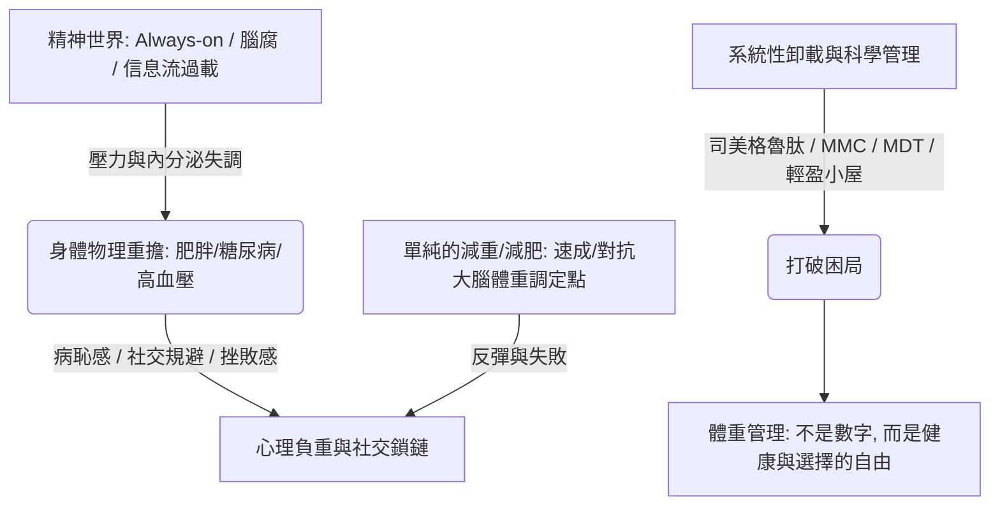

## 核心洞察
「重」是過載時代身心與生活負擔的物理投影。在「Always-on」的精神高壓與算法信息流的焦慮圍剿下，超重與慢病已成為集體症候。解決身心超載，無法單純歸咎於個人的「自我控制」，而需要從藥物創新、多學科醫療到社區家庭支持的「系統性卸載與科學管理」。

## 重點摘要

- **超載時代的集體症候**：
  - **精神與智識退化**：工作群紅點、無法離線的休假，「腦腐（Brain rot）」入選年度熱詞，41%的人經歷高度日常壓力。
  - **重作為一面鏡子**：李紅因生病激素與長期熬夜加班「Always-on」，體重飆升至 160 斤並出現糖尿病視網膜病變短暫失明。
- **對抗生理機制難以致勝**：
  - 大腦具有「體重調定點」，減重後的「代謝適應」會努力將體重拉回標準預設，因此屢戰屢敗的減重極易引發強烈的挫敗感與焦慮抑鬱。
- **科學與系統性織網的解法**：
  - **不止於藥的整合方案**：司美格魯肽等醫學創新，結合 MMC（國家標準化代謝性疾病管理中心）的多學科診療（MDT），將醫生轉化為共同前行的教練。
  - **打通最後一公里**：在零售藥店落地「輕盈小屋」，打通醫院到社區家庭的支持網絡，將單純的「減肥數字」改寫為長期的「體重健康管理」。

## 值得深思的問題
1. **商業零售與「輕盈小屋」的跨界啟發**：諾和諾德在全國零售藥店落地 1000 家「輕盈小屋」以打通「最後一公里」，這對我們的文旅與非標商業有何啟發？我們是否能與健康、減壓或心理療癒品牌跨界，在商場B1層或歷史街區中打造一個「城市輕盈/精神卸載小屋」？
2. **Always-on 的組織文化解毒**：李紅的超載源於白天的隨時響應與夜晚的熬夜工作。作為企業管理與流程優化的顧問，我們在引導企業進行數位化轉型的同時，應建立什麼樣的「離線權」機制，以防數位化工具變成無限榨取員工精力的絞肉機？
3. **病恥感與情感溢價的設計**：很多超重患者因病恥感而回避社交，李紅則用「卡皮巴拉（情緒穩定）」的樂觀外衣包裹其心理負重。在為生活方式品牌做用戶畫像與情感設計時，我們如何透過「無審判、極致接納」的品牌態度，瓦解這層沉重的防禦盔甲？

## 關聯筆記
- [[2026-05-18-慢性疲勞纏上年輕一代，查不出任何病，但我的身體真的「壞了」|慢性疲勞纏上年輕一代，查不出任何病，但我的身體真的「壞了」]]：兩者互為表裡——慢性疲勞是神經免疫系統的崩潰關機，而肥胖慢病則是內分泌與代謝系統的負重超載，都是 Always-on 過載時代的身體隱喻。
- [[2026-05-18-鄭州商業，實用主義的極致演繹|鄭州商業，實用主義的極致演繹]]：鄭州商業為高度超載、極需「省心卸重」的都市消費者提供了一站式降低「心力成本」的實體空間決策路徑。
- [[2026-05-18-橫店短劇大撤退，停工、降薪，與被擠掉的飯碗|橫店短劇大撤退，停工、降薪，與被擠掉的飯碗]]：AI 對真人短劇的效率替代，加劇了內容產業從業者面臨的高度焦慮與心力超載。
- [[2026-05-18-今年五一出行，大家都不想吃苦了|今年五一出行，大家都不想“吃苦”了]]：不想吃苦是精神過載的年輕人尋求「精神輕盈與卸載」的另一種集體無意識表達，寧可在酒店躺平也不要在景區受苦。
- [[2026-05-14-新鮮零食，擠進商場B1層|新鮮零食，擠進商場B1層]]：新鮮零食在商場底層的火爆，反映了消費者在極度超載、壓抑的都市生活中，企圖用低決策門檻的「健康小零嘴」來進行即時的輕量級自我補償。
- [[2026-05-18-月入5萬，陪人爬山：爬著爬著，變味了|月入5萬，陪人爬山：爬著爬著，變味了]]：陪伴代償與精神卸重——在身心超載、社交高心力成本的重壓下，年輕人無力在現實中維護複雜的親密關係，轉而花錢購買「陪爬與一日男友」等明碼標價的無痛曖昧，作為低成本、高效率的情感卸重與舒壓代償。
- [[2026-05-18-絕望的直女：如何厭男又愛男？|絕望的直女：如何厭男又愛男？]]：觀念超載對活人生機的自我壓抑——「絕望直女」在泛女權主義的性別思慮過載中，以「審查掃描雷達」築起厚厚的心防，導致愛與性的活力全面蕭條空耗；這精確演示了當代都市人不僅身心超載，更在「觀念過度超載與精神包裝」中閹割了肉身與荷爾蒙的自然生命力。

---
> [!TIP]
> 組織設計的本質，是把對的人放在對的節奏裡。
