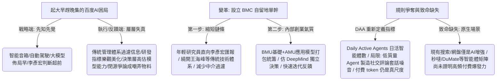

## 核心洞察
百度常年被調侃「起大早，趕晚集」，李彥宏戰略方向看得極早，交付結果卻總是不夠硬。這說明百度的根子不在戰略，而在「執行層、反饋層與判斷層的信息失真」——**「傳統成熟大公司的科層制管理，會系統性過濾、樂觀美化一線研發數據，傳遞到決策層的往往不是真實世界。」** 百度新設「模型委員會 BMC」（由年輕、懂模型的研究員構成）直接向李彥宏匯報，本質上是在大技術體系外單單劃出一塊「AI 自留地」，實施**縮短一線決策鏈條的內部創業「單幹」機制**。然而，組織隊伍可以重組，DAA（日活智能體數）的外部規則可以試圖重新定義，但**原生 AI 的殺手級應用場景無法靠組織架構自然長出**。

## 重點摘要

- **「起大早趕晚集」的信息失真根源**：
  - 李彥宏對「閉源大模型才有前途」的戰略判斷在全球大模型商業化（OpenAI、Google 等）路徑中是成立的。但當文心大模型在體驗與口碑上未展現統治力時，這個判斷便成了外界嘲弄的物料。其根本原因在於，CEO 依賴的研發進度、模型指標等信息被組織慣性層層樂觀化過濾，導致決策層高估了真實的模型能力。
- **BMC 自留地的「單幹」本質**：
  - BMC 統籌基礎模型（BMU）與應用模型（AMU）的協調，其核心在於讓年輕、對大模型有一線深刻理解的研究員直接向李彥宏匯報。這種直接越過層層管理匯報的決策鏈條，接近全球頂級 AI 創業公司（DeepMind）的獨立決策氣質，旨在以「內部創業單幹」方式修正組織失真。
- **DAA 與原生應用場景的邊界**：
  - 百度提出 DAA（日活智能體數）指標，試圖搶奪 AI 應用時代的話語權與計分規則，強調 Agent 完成任務的次數而非單純 Token 消耗。但 DAA 有致命軟肋：Agent 可輕易被部署刷量，低質量 Agent 只會製造大量的套話噪音（如社交媒體 AI 評論）；而 Token 消耗作為付費資源，依然是目前最實實在在的商業價值認可。此外，百度仍極度缺乏高頻、能充分激發付費的原生 AI 殺手級場景。

## 值得深思的問題
1. **CEO 如何在大模型時代進行「真實信息防禦」**：李彥宏需要通過 BMC 繞開層層技術匯報，才能獲取一線真實的模型能力數據。作為企業顧問，當我們面對客戶的決策層常年被高管「報喜不報憂、滿紙大廠黑話、PPT 美化指標」包圍時，我們該如何為其設計一套「直達一線、直觀體驗成品」的「防污染信息傳遞系統」？
2. **「低質量 Agent 社交噪音」對品牌行銷的負面侵蝕**：李彥宏認為 DAA 是未來，但文章犀利指出低質量 Agent 產生的自動回覆只會增加用戶的注意力負擔。我們在為品牌做 AI 賦能行銷時，如何防範「AI 自動化灌水」導致品牌溫度降為冰點、客戶好感流失的「賽博污染」？如何確保 AI 智能體的交付是具備情感與深刻洞察的？
3. **既有場景「AI 增強」與「原生殺手級應用」的鴻溝**：百度App、文庫等僅是舊有產品的「AI 增強」，而非「原生 AI 應用」。我們在輔導創業者與小團隊時，如何引導他們放棄在舊系統上打補丁，而是從 0 到 1 尋找那些只有大模型能力才能實現的、能激發強大付費意願的「原生非標場景」？

## 關聯筆記
- [[2026-05-18-按要求「蒸餾」自己後，他們被裁了|按要求「蒸餾」自己後，他們被裁了]]：本篇指出的「百度大公司科層制對一線信息的過濾與修剪」，正是大廠打工人配合系統自我蒸餾後，決策層基於優化指標所進行的「無情裁員」決策背景——皆是科層制下活人被標準件化、信息失真後的組織悲劇。
- [[2026-05-18-Markdown 已死，HTML 登基，極客思維正在毀掉你的交付力|Markdown 已死，HTML 登基：極客思維正在毀掉你的交付力]]：結果交付與真實體驗——李彥宏提出 DAA 日活智能體指標以強調完成任務（結果思維），但低質量的 Agent 噪音只會帶來負面體驗。這高度共鳴了交付邏輯中「乾巴巴的過程指標（Token/Agent數量）代表成本，唯有給泛人群交付色彩斑斕、直擊痛點的 HTML 成品體驗才是第一說服力」。
- [[2026-05-18-想轉行AI產品經理，90%的人第一步就走錯了！|想轉行AI產品經理，90%的人第一步就走錯了！]]：AI 應用與落地拼圖——百度的秒噠、DuMate 智能體矩陣，正是 AI 產品經理應用型落地拼圖的巨型範本。這再次印證了在 AI 時代，核心的壁壘不是死磕基礎模型的參數（極客偏執），而是敏銳捕獲原生殺手級應用場景、調用 AI 技術拼圖進行實務交付。

---
 > [!TIP]
 > 大公司起大早趕晚集的根子，往往不在戰略，而在於層層匯報的信息美化過濾，讓決策者高估了真實戰力。在 AI 狂飆的時代，科層制的官僚中介必須被無情繞開，讓最懂模型的一線研究員直面決策中心。請記住，指標（DAA/Agent數量）可以被輕易粉飾，但使用者的付費意願與驚艷的原生場景體驗，永遠是衡量商業價值最誠實的尺度。
