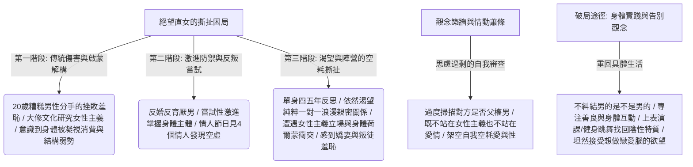

## 核心洞察
這是一份直擊當代都市覺醒女性心靈最隱秘、最痛苦撕扯的「情動民族志」：**「當流行的性別觀念與主義將女性從舊的異性戀機制上『解構』下來時，往往也以『思慮過剩』的道德審查，在女性周圍築起了另一座自我閹割、自我防禦的觀念圍牆。」** 31 歲人類學研究者白魚的個人成長與田野實踐深刻揭示：覺醒的異性戀女性（直女）對深刻的一對一浪漫純粹親密關係的需求是從內部生長出來的「真需求」，而非社會建構的幻象。但她們因為無法信任男性，且受限於社群「厭男/不婚不育」的政治正確審查，對自己的異性戀欲望產生了深深的「叛徒羞恥感」，進而陷入愛與性的長久蕭條與精力空耗。**「要走出絕望的圍城，唯有拒絕思慮過剩的觀念審查，通過健身、跳舞、表演等身體互動的在場，在具體的人際交往中重新接納自己的陰性特質與欲望本真。」**

## 重點摘要

- **「厭男又愛男」的絕望根源**：
  - 泛女性主義社群將大眾預期調整為「男的總歸是男的」（無論其多文明，終會開黃色笑話或凝視女性），讓覺醒女性在約會中開啟 24 小時雷達掃描，判定對方是否為父權男。同時，她們體內對「被愛、被保護、一對一浪漫關係」的強烈異性戀生理與心理需求無法被消滅，兩股力量的劇烈對撞導致了空耗與「愛與性的蕭條」。
- **「叛徒羞恥感」與觀念築牆**：
  - 當女性試圖承認自己渴望婚姻與家庭時，往往會面臨社群內「背叛陣營、嬌妻文學、不配同情」的激烈指責。這種本來旨在解放女性的主義，卻在實踐中變成了一套機械式的「女性審查標準」，將個體夾架在「主義」與「愛情」的夾縫中，既無法與女性主義站在一起，也無法投入真愛，進而築起了與世界隔絕的防禦高牆。
- **身體實踐自救與陰性力量回歸**：
  - 觀念的空耗與防禦，無法通過邏輯思辨打破，只有通過「身體」和「具體行動」才能療癒。白魚通過健身、跳舞、上表演課（用姿態表達性別創痛）等方式，重新找回曾被自己排斥、怪罪的「女性身體部分與陰性特質」。不再死磕「男性是否能完全共情女性處境」，轉而關注其是否「善良」，以溫柔的真實交往告別思慮過剩。

## 值得深思的問題
1. **「用腦衛生」與「觀念過度超載」的群體修復**：白魚的論文揭示了「流行觀念（思慮過剩）對主體性與荷爾蒙的壓抑」。在這個人人都被社交媒體各種「對立觀念、黑話標籤（如嬌妻、父權、PUA、情緒價值）」硬控的時代，我們作為用腦衛生與情緒管理顧問，該如何幫助客戶進行「觀念排毒」？如何引導他們從「賽博觀念審查」退回到「具體生活、呼吸與身體在場」？
2. **商業包裝中「真實脆弱陰性特質」的重新開窗**：白魚提到過去自己通過長胖、中性化包裝自己來尋求安全感，但最後選擇透過跳舞和演戲找回被壓抑的陰性特質。在面向新一代獨立女性的消費品牌（香水、服飾、護膚品）包裝與文案設計中，我們如何打破「一味宣傳女漢子、大女主、去性化」的單一政治正確，巧妙地為她們體內「渴望浪漫、承認脆弱、接納陰性溫柔」的真切需求提供優雅、無罪惡感的釋放出口？
3. **「老實與善良」在關係資產定價中的核心回歸**：當我們對男性的要求從「必須是高情商、滿分女權主義者（這通常是虛假的表演）」退回到「看他在不能完全理解女性的狀況下，願意努力付出多少，看他是否善良」，我們其實是重新找回了關係資產的「常識」。這對非標文旅與社區營造中的「人情味與真實信任建立」有何啟迪？

## 關聯筆記
- [[2026-05-18-當身心與生活都在超載，我們該如何找回失落的輕盈|當身心與生活都在“超載”，我們該如何找回失落的輕盈]]：觀念超載與大腦超速——「絕望直女」的痛苦正是典型的「觀念超載與大腦思慮過剩」，兩者皆指出需要「關閉雷達、停止大腦超速運轉、退回到身體的在場、跳舞與健身」來修復活人感與失落的輕盈。
- [[2026-05-18-工作毀掉了我美好的人性|工作毀掉了我美好的人性]]：主體性的異化與被修剪——工作用精密的指標與工具性摧毀了打工人美好、溫潤的人性，這與「流行的性別觀念（主義指標）用機械的政治正確與道德審查摧毀了女性對愛、性與身體陰性特質的自然渴望」在底層邏輯上完全相通，皆是「工具性指標（極客偏執）對活人生機的無情閹割與修剪」。
- [[2026-05-18-熬過1480天的大廠人，不再渴望上岸|熬過1480天的大廠人，不再渴望上岸]]：退回生活常識的自救路徑——大廠人張小滿厭倦了「大廠考核與算計」，退回寫作與做飯的常識；白魚厭倦了「泛女權主義的情感審查」，退回到健身、跳舞、與具體善良的男性真誠約會的常識，兩者都是拋棄系統性宏大符號，回歸肉身實踐的自我拯救範本。

---
> [!TIP]
> 所有的情緒問題，背後都是邊界問題。
