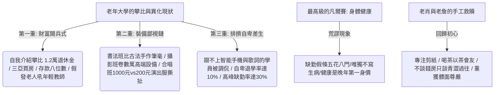

## 核心洞察
當 2000 萬退休老人重新戴上校徽，本應「老有所樂」的老年大學卻演變成了高度異化、攀比森嚴的「銀髮名利場」。從自我介紹時攀比退休金 1.2 萬、寶馬車與存款八位數的「財富閱兵式」，到書法班拼古法筆毫、攝影班卷數萬單反的「裝備鄙視鏈」，再到排擠記不住步驟與詞的「差生」導致退學狂潮，**「年輕時的 KPI 是業績與升遷，老了之後的 KPI 異化為退休金、房產證與身體健康凡爾賽。」** 老肖在隨遷上海下面臨的失落，以及在兒子點醒下轉向手工班、與不炫豪宅只專心剪紙的老詹「以茶會友」的過程證明：**「對抗老齡化焦慮的唯一解藥，是剝離金錢與裝備的外衣，回歸自我熱愛、重建溫情聯結、在晚年重尋社會歸屬感與主體尊嚴。」**

## 重點摘要

- **退休後的 KPI 異化與銀髮名利場**：
  - 中國正步入深度老齡化，老年大學在校學員突破 2000 萬。但本地戶籍老人與隨遷老人的資源差距（如老肖三千多退休金與上海老人的對比），讓免費公益學校演變成無情的身價標價場。
  - **身體健康作為最高級的凡爾賽**：合唱班缺勤率達 30%，請假條寫帶孫子、打牌、旅遊，但鮮少有人寫「生病」——因為在老年大學裡，健康是不能退讓的第一身價，承認「不行」比承認「沒錢」更難堪。
- **裝備鄙視鏈對自卑差生的排擠**：
  - 廣義文娛類課程是攀比的重災區。有錢有裝備、會來事的老人私下拉微信群形成精英圈子，排擠學習進度慢、跟不上智能手機班步驟的「差生」，導致每年 10% 的退學潮，公益資源嚴重浪費。
- **自洽回歸與溫情聯結**：
  - 老肖在兒子的開導下（「學生的任務是學習不是攀比，為了找到熱愛生活的自己」）沉下心來。
  - **手工班的詹大師**：70 歲的老詹沒有豪宅，只有對剪紙技藝的痴迷，願意一個步驟教十遍。不上課時以茶會友、不談錢房，讓老肖在剝離金錢外衣後，感受到了老年大學最溫暖動人的社交歸屬感。

## 值得深思的問題
1. **「身體健康是最高凡爾賽」背後的老年精神危機**：老年人不寫「生病」請假條，是因為晚年失去了職業與金錢增量的可能性後，「身體功能」成了個人主體價值的最後防線。在面向老年市場或大健康 IP 時，我們如何提供「不止於藥」的陪伴？如何用尊重主體性尊嚴的微觀儀式（如老詹的手工課、喝茶會），去化解他們的身體功能焦慮？
2. **隨遷老人（老漂族）在都市的「關係重組」難題**：隨遷老人面臨本地優越圈子的無情降維打擊，是極度脆弱的孤島。在社區商業或物業服務設計中，如何協助隨遷老人重建「非金錢攀比的溫情聯結（如老詹的茶話會、出遊小隊）」？這蘊含著哪些長輩市場的商業機會？
3. **從「身價高低」到「自我安頓」的認知格式化**：老肖經歷了「退學-硬著頭皮去-跟風自卑-兒子點醒-老詹手工救贖」的轉變。我們身處職場的年輕人每天也在為年薪、學區房而瘋狂內卷焦慮。我們該如何將自己「重新格式化為學生」？在每天的內耗中，如何找到像「老詹剪紙」那樣不為取悅他人、只為安頓自己的純粹熱愛？

## 關聯筆記
- [[2026-05-18-熬過1480天的大廠人，不再渴望上岸|熬過1480天的大廠人，不再渴望上岸]]：極度相似的「反內卷與回歸真實生活」自救路徑——大廠人在標準件與數據凝視下崩潰，自救的防線是打破「上岸」執念、回歸老實散步與素人寫作；而退休老肖在老年大學名利場被降維打擊後，自救防線是打破「身價攀比」、回歸到手工剪紙與喝茶以茶會友。
- [[2026-05-18-當身心與生活都在超載，我們該如何找回失落的輕盈|當身心與生活都在“超載”，我們該如何找回失落的輕盈]]：兩者都在探討「面對不可逆的衰老與系統重壓，如何尋求體面、從容與尊嚴的輕盈安頓」——超載社會需要輕盈小屋與整合支持系統以維持主體性，而老年大學學員則需要在老詹的無炫耀溫情聯結下，獲得對抗老齡化最溫柔的歸屬答案。
- [[2026-05-18-韓國時尚卷王殺入中國，3家店開局就火，放話要再開100家|韓國時尚卷王殺入中國，3家店開局就火]]：品牌包裝與中產精緻包裝的「裝備鄙視鏈」——韓國卷王用精美的空間與潮人包裝吸引打卡攀比，老年大學老人用高檔相機與 1000 元演出服進行財富閱兵。兩者均揭示了轉型期社會中，大眾習慣用外在的「裝備/包裝」去掩蓋內在安全感的缺失與空虛。

---
> [!TIP]
> 文化的生命力，來自不被定義的混亂。
