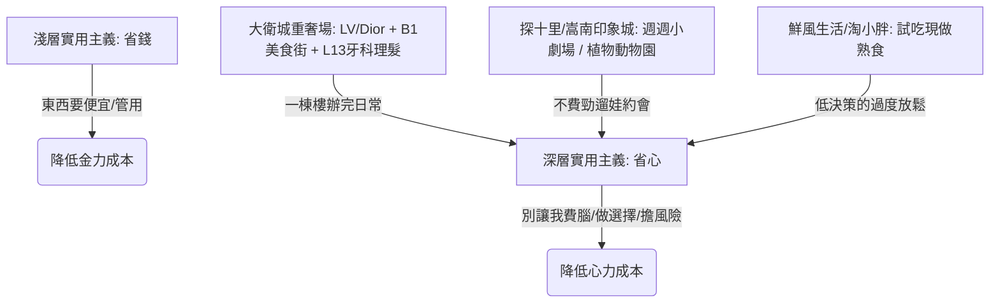

## 核心洞察
鄭州商業是「實用主義」的極致範本。實用主義的淺層是「省錢（解決金力成本）」，深層則是「省心（解決心力成本）」。不論是將整座城市的煙火日常塞進15層奢華高樓的丹尼斯大衛城，還是用動物與小劇場塞滿周邊居民日常的社區商業，鄭州商業的本質在於直接止痛，降低消費者的決策與心理負擔。

## 重點摘要

- **鯰魚效應與中規中矩的死穴**：
  - 鄭東萬象城（24萬方）開業一年，透過新體驗、新生活方式分流了傳統商圈。
  - 熙地港因十年未做升級、受體量局限，被兩側商圈直接瓜分。揭示了「中規中矩吃一畝三分地，以為是能力，其實是紅利」的商業陷阱。
- **深層實用主義：極致省心**：
  - **T10探十里**：西區家庭周末去處，開業至今舉辦幾百場劇院演出（週週不斷），配備極致乾淨的母嬰室、家庭衛生間與兒童托管。
  - **嵩南印象城**：2萬方小體量，在廣場免費打造植物花園與動物園（養鴨兔羊），用「動物員工」將項目打造成週邊兩公里的「私家花園」。
  - **丹尼斯大衛城**：將 22 萬方的重奢高冷場，在 B1 塞進 64 家餐飲美食街，L13 塞入牙醫、理髮、男士理容、奢侈品養護與 SPA，跨越 15 層，樓上樓下熱鬧非凡。
  - **社區超市（鮮風生活、淘小胖）**：在從物質滿足向體驗滿足的過度期，提供一個「低成本、高確定性、可控快樂」的食堂感熟食現做空間。

## 值得深思的問題
1. **「省心」在台灣社區商業的平移**：台灣都市密度極高，超商（如 7-Eleven、全家）早已將「生活便利性」做到了極致。但在「心力成本」的卸載上（如寶媽遛娃的社交安全感、長者的日常陪伴感），台灣的區域型與社區商業是否還有升維空間？我們如何為台灣社區設計出像嵩南印象城般具備「高情緒回報率（ROX）」的動物或綠色第三空間？
2. **重奢與煙火氣的「大衛城雜糅模式」**：傳統商業邏輯認為，重奢品牌（如 LV、Dior）需要極度安靜、排他的「高冷感」，而大衛城卻將其與15層的理髮牙醫、大排檔式美食街完美雜糅並大獲成功。在我們引導文旅目的地和老街區（如中山七三）調改時，是否也應打破「高雅與低俗」的僵硬劃分，用「把日常塞進空間」的邏輯來重組業態？
3. **北方人情圈子消費的信任資產**：北方城市極度看重單位人群、人情圈子的黏性深耕。在數位化會員系統日漸冷酷、流於積分兌換的當下，我們如何為生活方式品牌建立一套具備「溫暖顆粒度」的人情化會員服務體系？

## 關聯筆記
- [[2026-05-18-為什麼追年輕人的商業，容易火但不容易持久？|為什麼追年輕人的商業，容易火但不容易持久？]]：丹尼斯大衛城能將重奢 LV 與 B1 美食街、L13 牙醫理髮完美雜糅，本質上就是用「極致省心的日常實用主義（MUJI式的第一百次回來）」，完成了全客層、跨週期的變現漏斗設計。
- [[2026-05-18-當身心與生活都在超載，我們該如何找回失落的輕盈|當身心與生活都在超載，我們該如何找回失落的輕盈]]：兩者高度同頻——深層實用主義的「省心」，本質上就是為 Always-on 時代極度超載的身心，進行低成本、高確定性的「精神與心力卸重」。
- [[2026-05-18-拋棄漂亮飯的年輕人，集體鑽進老式咖啡餐吧|拋棄漂亮飯的年輕人，集體鑽進老式咖啡餐吧？]]：老式咖啡餐吧以極低的決策成本與不緊繃的鬆弛氛圍，完美呼應了實用主義「省心、直給快樂、不問前程」的日常消遣心理。
- [[2026-05-15-麥記牛奶：糖水賽道的窗口期策略|麥記牛奶：糖水賽道的窗口期策略]]：麥記牛奶用高確定性、可見的現做流程與高性價比，在品類紅海中提供了一種「低心力決策的甜味自救體驗」。

---
> [!TIP]
> 餐飲品牌的壁壘，不在廚房在記憶。
