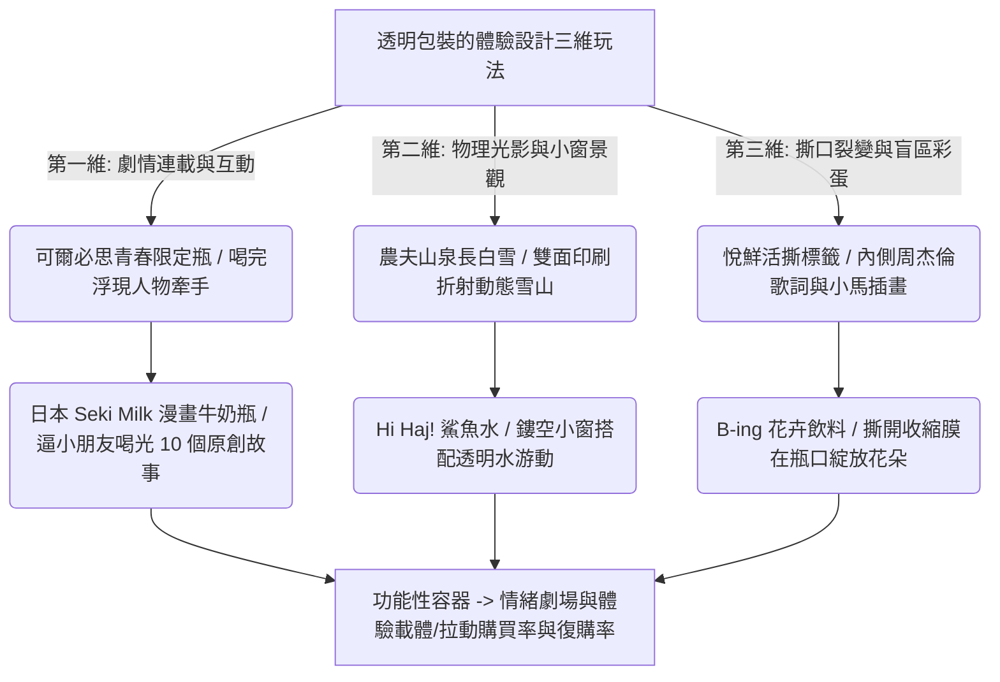

## 核心洞察
在實體零售高度內卷與消費降級的背景下，傳統的功能性包裝已無法喚醒消費者的購買欲望。品牌紛紛利用飲料瓶的透明特性、液體自身的遮擋顏色、以及標籤紙貼膜的雙面印刷，把平庸的「裝液體容器」改造為極具趣味的「情緒劇場與體驗載體」。不論是可爾必思的青春單戀、Seki Milk 讓 95% 小朋友喝光牛奶的「四格漫畫連載瓶」、農夫山泉長白雪的「雪山光影放大鏡小窗」，還是悅鮮活黑色標籤底下的「杰倫歌詞/小馬插畫」盲區彩蛋，均證明了：在低信任與注意力粉塵化時代，**「包裝本身就是產品的內容與情緒存取接口」**，透過儀式感與喝完見驚喜的驚喜感，品牌成功將功能定價躍升為情緒定價。

## 重點摘要

- **第一維：劇情連載與互動（喝完才解鎖的彩蛋）**：
  - **可爾必思夏季限定青春瓶**：利用乳白液體遮擋，喝完整瓶才能解鎖另一面的人物，正反面插畫結合成「放學牽手/好友趕海」的青春場景，將單戀酸甜感與飲料口感完美融合。
  - **Seki Milk 漫畫牛奶瓶**：為了解決 65% 小學生喝不完午餐牛奶的問題，品牌在透明瓶印白色四格漫畫。當牛奶喝下去，漫畫一格格「浮現」出來，共繪製 10 個原創牛奶科普故事，成功讓 95% 小朋友把牛奶喝得一滴不剩。
- **第二維：物理折射與小窗景觀**：
  - **Hi Haj! 鯊魚水**：在標籤留鏤空窗，水滿時透過窗看去，鯊魚就像在水裡游動，轉動瓶子鯊魚跟著游動，把極簡水做成了趣味互動。
  - **長白雪礦泉水**：利用水的折射作為天然放大鏡，正面鏤空保護動物，背面雙面印刷雪山。旋轉瓶子時，雪山景色隨折射動態移動，頂部的山形切割面強化冰晶質感。
- **第三維：撕口裂變與盲區彩蛋**：
  - **B-ing 花卉飲料**：利用雙面印刷收縮膜與預留虛線撕口。消費者打開瓶口撕下膜時，膜順勢翻開，露出內側花瓣，一朵花在瓶口「盛裝綻放」。
  - **悅鮮活黑色標籤下印歌詞**：在常規黑色標籤內側印周董歌詞與小馬插畫，在「視覺盲區」留驚喜，引發社交平台「啞巴式浪漫」的自發傳播。

## 值得深思的問題
1. **包裝作為「免費的流量特渠與媒介」**：許多品牌花費巨資在線上投廣告，卻把最貼近用戶的「產品包裝」做成了平庸乏味的公告欄。這篇案例證明了包裝本身就是最好的「高頻媒介」與「傳播渠道」。我們在為文創或傳統食飲品牌做品牌重塑時，如何引導客戶重新評估包裝標籤的「媒介版面價值」？如何把包裝做成一個可以不斷連載、開窗的「情緒舞台」？
2. **「儀式感設計」降低日常心力焦慮**：從「撕開包裝在瓶口綻放一朵花」到「喝完可樂看見反轉的溫情表白」，這些精妙的微觀儀式感，如何為 Always-on 高壓社會下的年輕人，提供了一次無壓力的「情緒撫慰與心靈卸載」？我們的體驗設計框架，該如何引入這些低門檻、即時反饋的「微儀式」？
3. **「Seki Milk 漫畫牛奶」對遊戲化組織管理的啟示**：Seki Milk 不講大道理，用四格漫畫連載成功「誘導」95% 小朋友喝光牛奶。這背後是行為設計學中的「即時反饋與好奇心驅動」。在企業治理或知識管理（例如讓員工老實進行文檔寫入）中，我們能否引入類似「喝完才能看連載」的遊戲化誘因機制？

## 關聯筆記
- [[2026-05-18-韓國時尚卷王殺入中國，3家店開局就火，放話要再開100家|韓國時尚卷王殺入中國，3家店開局就火，放話要再開100家]]：氛圍感與情緒溢價的極致實踐——Musinsa 透過韓劇主角版型販賣「氛圍感主角情緒溢價」，而透明瓶身設計則透過視覺開窗與漫畫互動販賣「青春單戀/雪山探險」的情緒體驗，兩者都在消費降級時代重構了實用商品的審美與體驗價值。
- [[2026-05-14-新鮮零食，擠進商場B1層|新鮮零食，擠進商場B1層]]：健康焦慮與視覺投名狀——新鮮零食透過「短保現製」滿足消費者的健康焦慮，而透明牛奶瓶/水瓶則透過「透明直觀、物理折射、喝光即現」的包裝視覺遊戲，提供了一種「乾淨、天然、新鮮看得見」的視覺信任安慰劑。
- [[2026-05-18-正式確診為 P 人！雀巢8次方的新包裝又雙叒叕對樂迷下手了|正式確診為 P 人！雀巢8次方的新包裝又雙叒叕對樂迷下手了]]：包裝作為社交嘴替與應援周邊——飲料瓶透過透明折射講述「喝完才現」的微觀劇場，而雀巢 8 次方則將雪糕包裝直接進化為「MBTI 人格標籤 × 音樂歌詞」的人格歌單接口與線下音樂節應援社交貨幣，兩者都在踐行「包裝即第一內容與體驗載體」的溢價飛躍。
- [[2026-05-18-母親節營銷案例複盤，不歌頌只看見|母親節營銷案例複盤，不歌頌只看見]]：細節載體的療癒觸摸——東阿阿膠復刻 90 年代泛黃掛歷美學，抖音生服將小店「歡迎光臨」地墊微調為「歡迎回家」地墊；這些極微小的物理媒介微調，與可爾必思單戀瓶、Seki Milk 牛奶瓶的漫畫設計本質相通——皆是用精妙的情感細節去溫暖並刺穿漂泊中產的心理防禦，將平庸的物理接觸改寫為深刻的情感接口。

---
> [!TIP]
> 產品只是一具功能性的肉身，包裝才是它靈魂的劇場。在連廣告都嫌吵的年代，別再把包裝當成平庸的配料表貼紙。大膽地利用液體與光影，為消費者在瓶子裡開一扇窗、留一個杰倫的彩蛋、連載一個漫畫故事——當消費者為你的「微互動」會心一笑時，功能性的產品就長成了無價的情感伴侶。
